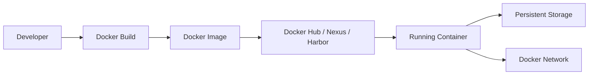
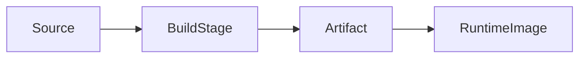
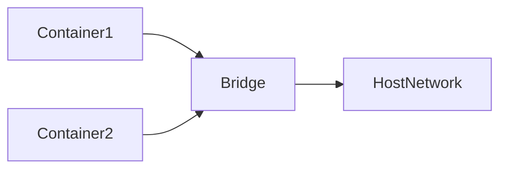
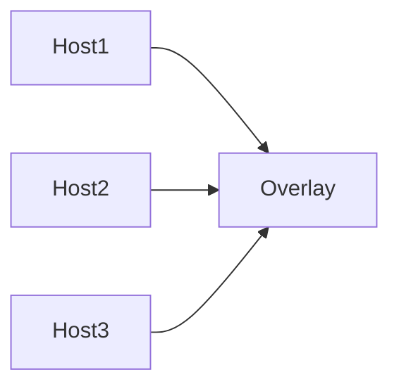
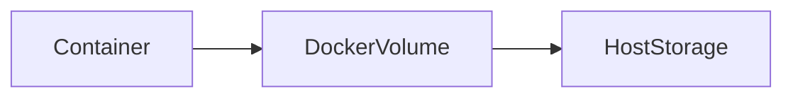
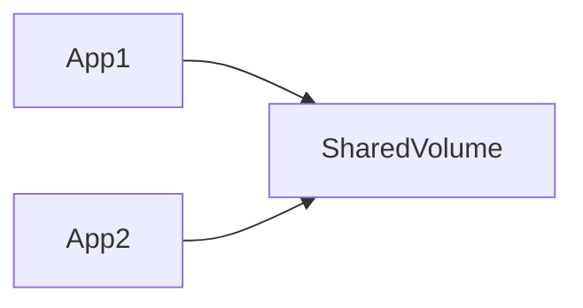
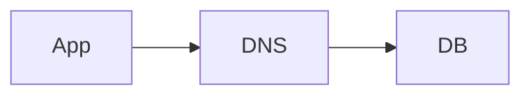

# Docker Core Concepts (15–28)



## 15. How do you create and push a custom Docker image to Docker Hub?

### Answer

Step 1: Create a Dockerfile

```dockerfile
FROM nginx
COPY index.html /usr/share/nginx/html
```

Step 2: Build the image

```bash
docker build -t sreejith/myapp:v1 .
```

Step 3: Login

```bash
docker login
```

Step 4: Push image

```bash
docker push sreejith/myapp:v1
```

---

## 16. What are multi-stage builds and why are they crucial for production?

### Answer

Multi-stage builds allow building applications in one stage and copying only required artifacts into the final image.

Benefits:

- Smaller image size
- Improved security
- Faster deployment
- Reduced attack surface

Example:

```dockerfile
FROM maven:3.9-eclipse-temurin-17 AS build
COPY . .
RUN mvn clean package

FROM eclipse-temurin:17-jre
COPY --from=build target/app.jar app.jar
ENTRYPOINT ["java","-jar","app.jar"]
```



Step 1
FROM maven:3.9-eclipse-temurin-17 AS build

👉 Download a Docker image that contains Maven and Java 17 for building the application, Creates a build stage named build.

Step 2
COPY . .

👉 Copy all application source code into the container.

Step 3
RUN mvn clean package

👉 Compile the code and create app.jar.

Step 4
FROM eclipse-temurin:17-jre
COPY --from=build target/app.jar app.jar

👉 Create a new lightweight image with only Java Runtime and copy the generated JAR file into it.

Step 5
ENTRYPOINT ["java","-jar","app.jar"]

👉 Start the application using:

java -jar app.jar


---

## 17. What are dangling images, and how do you safely prune them?

### Answer

Dangling images are untagged images not referenced by any container.

List dangling images:

```bash
docker images -f dangling=true
```

Remove dangling images:

```bash
docker image prune
```

Remove all unused images:

```bash
docker image prune -a
```

---

## 18. How do you drastically reduce the size of a Docker image?

### Answer

Best Practices:

- Use Alpine images
- Use Multi-stage builds
- Remove unnecessary packages
- Combine RUN commands
- Clean package cache
- Use minimal runtime images

Example:

```dockerfile
FROM alpine:latest
```

---

## 19. Explain the default networking drivers in Docker (Bridge, Host, None).

### Answer

| Driver | Purpose |
|----------|----------|
| Bridge | Default container networking |
| Host | Shares host network |
| None | No network access |

Examples:

```bash
docker run --network bridge nginx
docker run --network host nginx
docker run --network none nginx
```



---

## 20. What is an Overlay network and when do you use it?

### Answer

Overlay networking connects containers running on multiple Docker hosts.

Used in:

- Docker Swarm
- Multi-node container clusters
- Distributed applications



---

## 21. How do two containers communicate when on the same default bridge network?

### Answer

Containers communicate using IP addresses.

Example:

```bash
docker inspect container1
```

Get container IP:

```bash
ping 172.17.0.2
```

Best practice:

Use a user-defined bridge network with DNS support.

```bash
docker network create app-net
```

---

# Persistence & Communication

## 22. What is the difference between EXPOSE and publishing a port (-p)?

### Answer

| EXPOSE | -p |
|---------|----|
| Documentation | Actual port mapping |
| Internal metadata | Accessible from outside |
| Does not open ports | Opens host port |

Example:

```dockerfile
EXPOSE 8080
```

```bash
docker run -p 8080:8080 myapp
```

---

## 23. How does Docker handle persistent data storage?

### Answer

Docker uses:

- Volumes
- Bind Mounts
- tmpfs

Volume Example:

```bash
docker volume create mysql-data

docker run -v mysql-data:/var/lib/mysql mysql
```



---

## 24. What is the primary difference between Bind Mounts and Docker Volumes?

### Answer

| Bind Mount | Docker Volume |
|------------|--------------|
| Uses host directory | Managed by Docker |
| Host dependent | Portable |
| Manual management | Docker managed |

Examples:

```bash
docker run -v /data:/app/data nginx
```

```bash
docker run -v app-volume:/app/data nginx
```

---

## 25. How do you safely share a single data volume across multiple containers?

### Answer

Create volume:

```bash
docker volume create shared-data
```

Mount volume:

```bash
docker run -d --name app1 -v shared-data:/data nginx
docker run -d --name app2 -v shared-data:/data nginx
```



---

## 26. What is a tmpfs mount in Docker and what is its primary use case?

### Answer

tmpfs stores data in memory instead of disk.

Benefits:

- Faster access
- No disk persistence
- Suitable for secrets and temporary files

Example:

```bash
docker run --tmpfs /tmp nginx
```

---

## 27. How do you link containers together without relying on IP addresses?

### Answer

Use user-defined bridge networks.

Create network:

```bash
docker network create app-net
```

Run containers:

```bash
docker run -d --name db --network app-net mysql
docker run -d --name app --network app-net myapp
```

Access:

```bash
mysql -h db
```



---

## 28. What happens to a container's written data when it is deleted without a volume?

### Answer

Container filesystem data is lost permanently.

Example:

```bash
docker rm -f mycontainer
```

Any files written inside the container are deleted.

To preserve data:

```bash
docker run -v mydata:/data nginx
```

---

# Quick Interview Summary

- Multi-stage builds reduce image size.
- Dangling images are unused images.
- Bridge is the default Docker network.
- Overlay connects multiple Docker hosts.
- EXPOSE documents ports.
- -p publishes ports externally.
- Volumes provide persistent storage.
- Bind mounts use host paths.
- tmpfs stores data in memory.
- User-defined networks provide container DNS.
- Container data is lost without volumes.
