# Docker Interview Questions and Answers: Orchestration, Compose, Security

This GitHub-friendly note covers questions **29 to 42** with simple answers, examples, and small Mermaid diagrams.

---

## 29. What is Docker Compose and how does it differ from a standard Dockerfile?

**Answer:**

A **Dockerfile** is used to build one Docker image.  
**Docker Compose** is used to run multiple containers together using one YAML file.

Example: a web application may need an app container, database container, and cache container. Docker Compose can start all of them together.

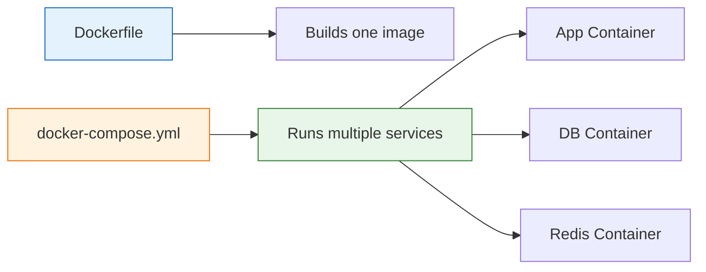

**Example Dockerfile:**

```dockerfile
FROM nginx:latest
COPY index.html /usr/share/nginx/html/index.html
```

**Example Compose file:**

```yaml
services:
  web:
    image: nginx:latest
    ports:
      - "8080:80"
```

---

## 30. Explain the structure and required elements of a docker-compose.yml file.

**Answer:**

A `docker-compose.yml` file defines services, images, ports, volumes, networks, and environment variables.

Common sections are:

| Section | Purpose |
|---|---|
| `services` | Defines containers to run |
| `image` or `build` | Image to use or build location |
| `ports` | Exposes container ports |
| `volumes` | Stores persistent data |
| `networks` | Connects containers |
| `environment` | Passes variables to containers |

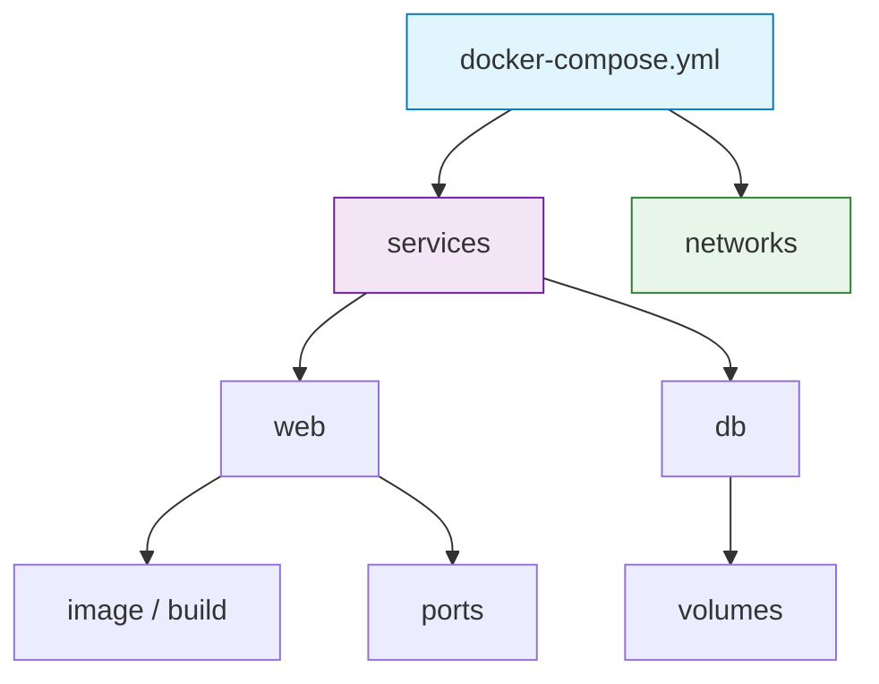

**Example:**

```yaml
services:
  web:
    image: nginx:latest
    ports:
      - "8080:80"

  db:
    image: mysql:8
    environment:
      MYSQL_ROOT_PASSWORD: root123
    volumes:
      - db_data:/var/lib/mysql

volumes:
  db_data:
```

---

## 31. How do you scale specific services up or down using Docker Compose?

**Answer:**

You can scale a service using the `--scale` option.

```bash
docker compose up -d --scale web=3
```

This starts **3 containers** for the `web` service.

To scale down:

```bash
docker compose up -d --scale web=1
```

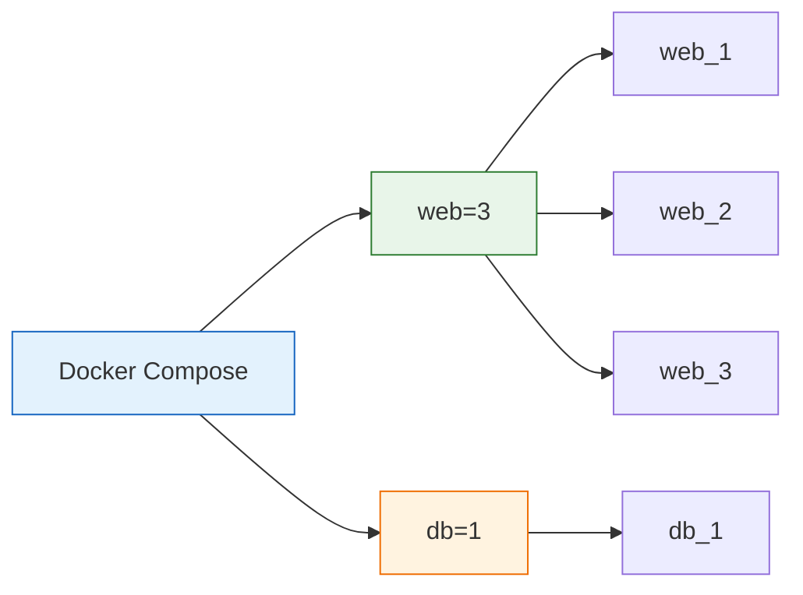

**Important:**

Do not bind the same host port when scaling multiple replicas. Use a reverse proxy or load balancer.

---

## 32. What is Docker Swarm, and how does it achieve high availability?

**Answer:**

Docker Swarm is Docker's native container orchestration tool. It manages containers across multiple servers.

It achieves high availability using:

- Multiple manager nodes
- Worker nodes for running containers
- Service replicas
- Automatic rescheduling if a node fails

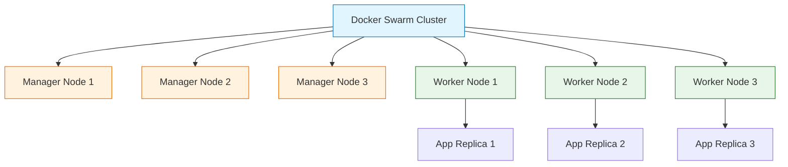

**Example:**

```bash
docker swarm init
docker service create --name web --replicas 3 nginx
```

---

## 33. What are the key differences between Docker Swarm and Kubernetes?

**Answer:**

| Feature | Docker Swarm | Kubernetes |
|---|---|---|
| Setup | Easier | More complex |
| Scaling | Simple | Advanced |
| Networking | Built-in overlay | CNI-based |
| Load balancing | Built-in | Service and Ingress based |
| Ecosystem | Smaller | Very large |
| Production usage | Smaller/simple setups | Enterprise and large-scale setups |

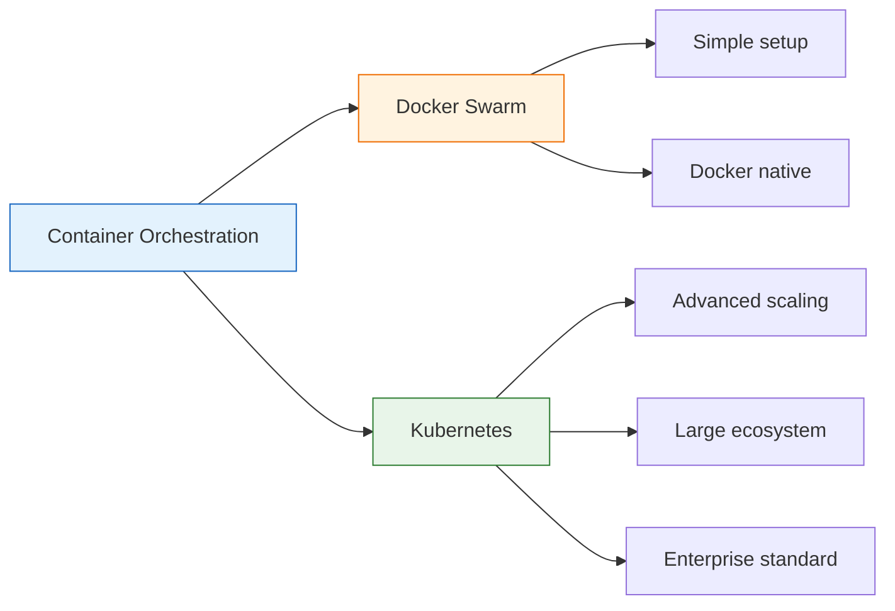

**Simple explanation:**

Docker Swarm is easier to start. Kubernetes is more powerful and widely used in production.

---

## 34. How do you restart a crashed container automatically using restart policies?

**Answer:**

Docker restart policies automatically restart containers when they stop or crash.

Common restart policies:

| Policy | Meaning |
|---|---|
| `no` | Do not restart automatically |
| `always` | Always restart if stopped |
| `on-failure` | Restart only when container exits with error |
| `unless-stopped` | Restart unless manually stopped |

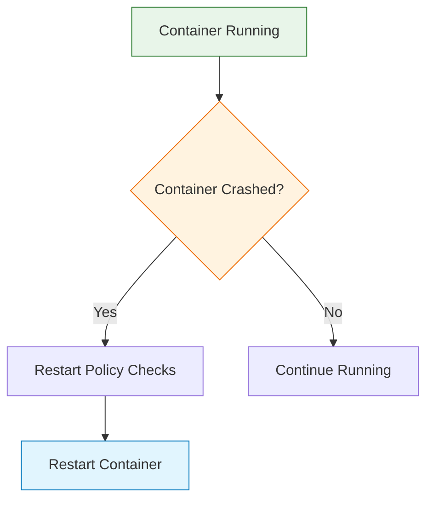

**Docker run example:**

```bash
docker run -d --name web --restart unless-stopped nginx
```

**Compose example:**

```yaml
services:
  web:
    image: nginx
    restart: unless-stopped
```

---

## 35. How do you gracefully stop a container vs. forcing it to kill?

**Answer:**

Graceful stop gives the application time to shut down properly.

```bash
docker stop container_name
```

Force kill stops the container immediately.

```bash
docker kill container_name
```

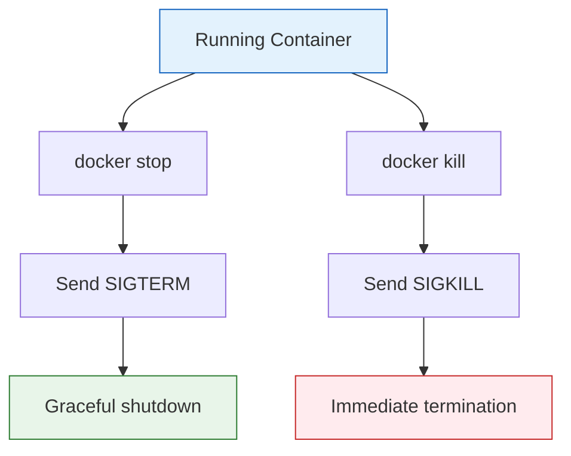

**Simple explanation:**

Use `docker stop` normally. Use `docker kill` only when the container is stuck.

---

## 36. Why is it a security risk to run container processes as the root user?

**Answer:**

Running containers as `root` is risky because if an attacker breaks into the container, they may get root-level access inside the container and possibly affect the host system, mounted volumes, or Docker socket.

Best practice is to run containers as a non-root user.

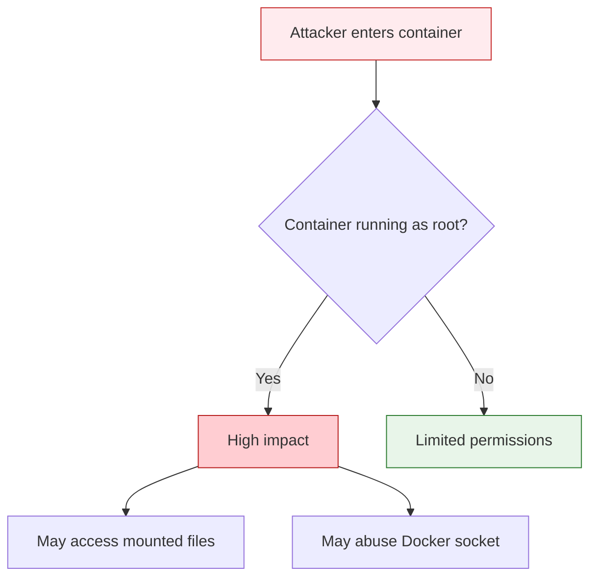

**Dockerfile example:**

```dockerfile
FROM ubuntu:24.04
RUN useradd -m appuser
USER appuser
CMD ["sleep", "3600"]
```

---

## 37. How do you securely manage sensitive data using Docker Secrets?

**Answer:**

Docker Secrets are used to store sensitive data such as passwords, API keys, and certificates securely.

Secrets are mounted inside the container as files, usually under:

```text
/run/secrets/
```

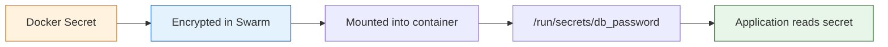

**Create secret:**

```bash
echo "MyPassword123" | docker secret create db_password -
```

**Use secret in Compose:**

```yaml
services:
  app:
    image: myapp:latest
    secrets:
      - db_password

secrets:
  db_password:
    external: true
```

---

## 38. What is Docker Content Trust and how does it verify image signatures?

**Answer:**

Docker Content Trust helps verify that Docker images are signed and trusted before they are pulled or used.

When enabled, Docker checks image signatures. If the image is not signed or trusted, Docker blocks the pull.

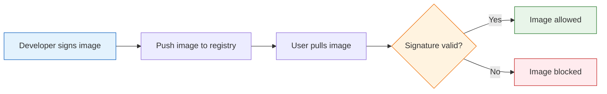

**Enable Docker Content Trust:**

```bash
export DOCKER_CONTENT_TRUST=1
```

**Pull image:**

```bash
docker pull nginx:latest
```

---

## 39. How do you scan your Docker images for known vulnerabilities before deployment?

**Answer:**

You can scan Docker images using tools like Trivy, Grype, Docker Scout, Anchore, Clair, or Nexus IQ.

A common open-source tool is **Trivy**.

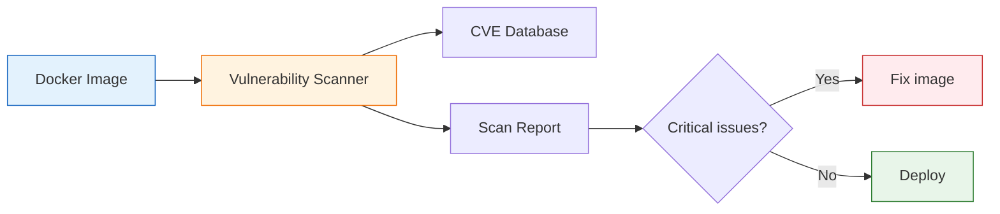

**Example:**

```bash
trivy image nginx:latest
```

**CI/CD example:**

```bash
trivy image --severity HIGH,CRITICAL --exit-code 1 myapp:latest
```

This fails the pipeline if high or critical vulnerabilities are found.

---

## 40. What is the purpose of a .dockerignore file?

**Answer:**

A `.dockerignore` file tells Docker which files should not be copied into the build context.

It helps to:

- Reduce image build time
- Avoid copying unwanted files
- Protect secrets
- Keep image size smaller

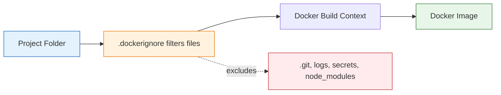

**Example `.dockerignore`:**

```text
.git
*.log
.env
node_modules
target
```

---

## 41. How do you securely restrict network access between containers in Compose?

**Answer:**

You can restrict network access by using separate Docker networks and only attaching services to the networks they need.

For example, the web container can talk to the app container, but it does not need direct access to the database.

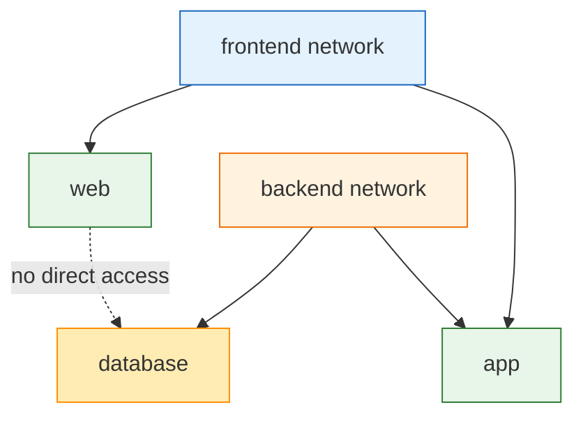

**Compose example:**

```yaml
services:
  web:
    image: nginx
    networks:
      - frontend

  app:
    image: myapp
    networks:
      - frontend
      - backend

  db:
    image: mysql:8
    networks:
      - backend

networks:
  frontend:
  backend:
```

---

## 42. What are the security implications of exposing the Docker daemon socket?

**Answer:**

The Docker daemon socket is usually located at:

```text
/var/run/docker.sock
```

Exposing this socket is dangerous because anyone with access to it can control Docker on the host.

They may be able to:

- Start privileged containers
- Mount host directories
- Read sensitive files
- Delete containers or images
- Gain root-level access to the host

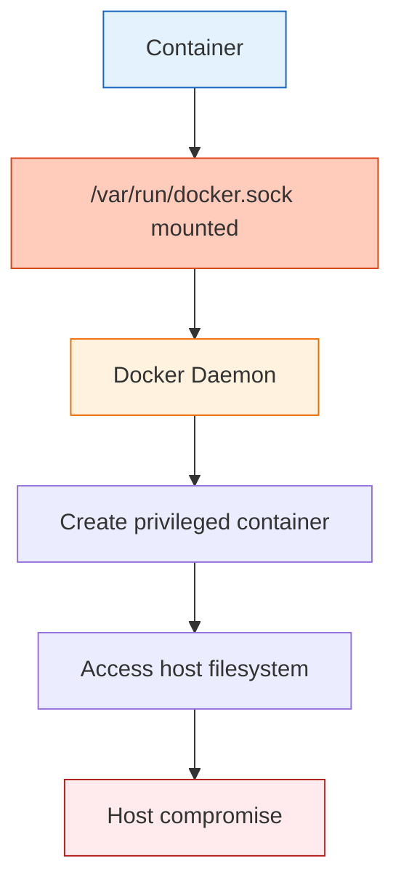

**Bad example:**

```bash
docker run -v /var/run/docker.sock:/var/run/docker.sock mycontainer
```

**Best practice:**

Avoid mounting Docker socket into containers. Use limited APIs, rootless Docker, least privilege, or dedicated CI runners.

---

# Quick Revision Table

| No. | Topic | Key Point |
|---|---|---|
| 29 | Docker Compose vs Dockerfile | Dockerfile builds image, Compose runs multi-container app |
| 30 | Compose structure | Services, ports, volumes, networks, environment |
| 31 | Scaling | Use `docker compose up --scale service=count` |
| 32 | Docker Swarm | Docker-native orchestration with managers/workers |
| 33 | Swarm vs Kubernetes | Swarm is simpler, Kubernetes is more powerful |
| 34 | Restart policies | Automatically restart crashed containers |
| 35 | Stop vs kill | `stop` is graceful, `kill` is immediate |
| 36 | Root user risk | Root container increases security impact |
| 37 | Docker Secrets | Store sensitive data securely |
| 38 | Content Trust | Verifies signed images |
| 39 | Image scanning | Detect CVEs before deployment |
| 40 | .dockerignore | Excludes files from build context |
| 41 | Compose network restriction | Use separate networks |
| 42 | Docker socket risk | Socket access can compromise host |
