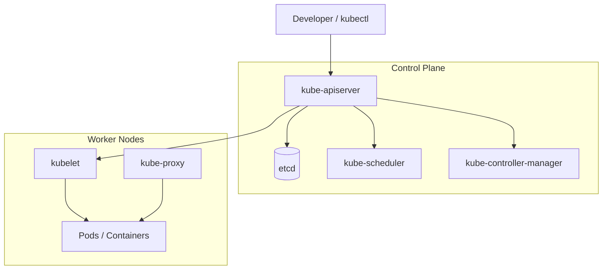
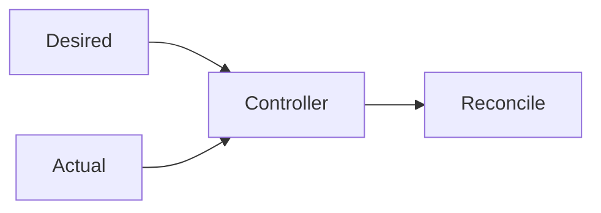
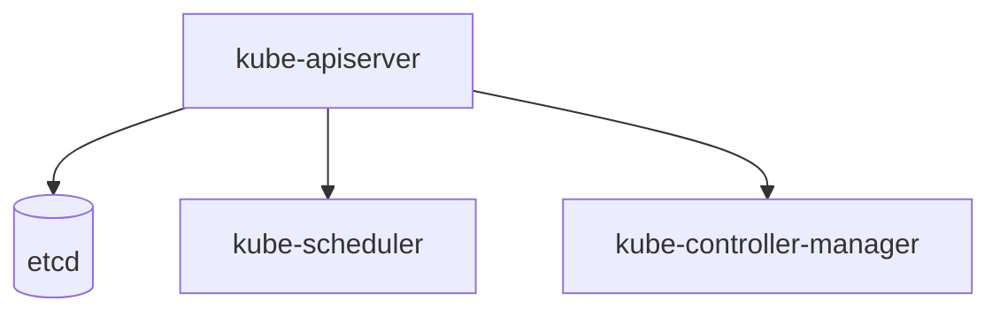
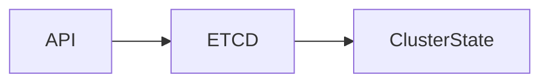
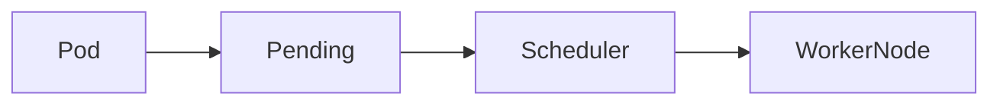
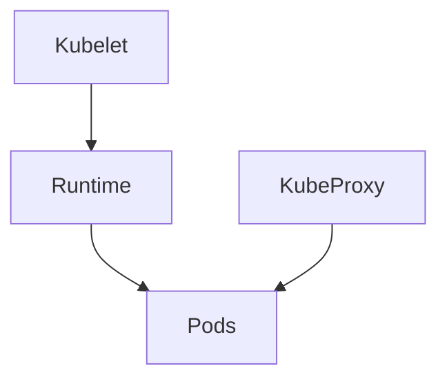
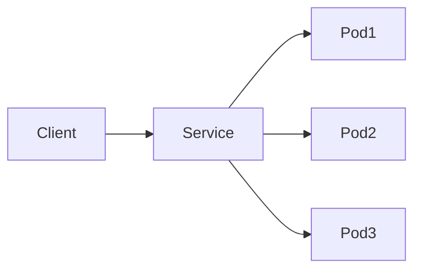
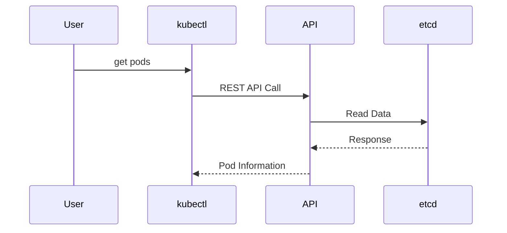

# Kubernetes Core Concepts (43–54)



# The Control Plane (Master Node)

## 43. What is Kubernetes (K8s) and what problems does it solve for microservices?

### Answer

Kubernetes (K8s) is an open-source container orchestration platform used to deploy, manage, scale, and monitor containerized applications.

### Problems Solved

- Automatic scaling
- Self-healing
- Service discovery
- Load balancing
- Rolling updates
- High availability
- Resource optimization

### Example

Instead of manually managing 100 containers, Kubernetes automatically manages them across multiple nodes.

---

## 44. Explain the fundamental concept of "Desired State vs. Actual State" in K8s.

### Answer

Kubernetes continuously compares:

- **Desired State** → What you define in YAML.
- **Actual State** → What currently exists in the cluster.

If differences are found, Kubernetes automatically reconciles them.

### Example

Deployment YAML:

```yaml
replicas: 3
```

If one pod crashes:

```text
Desired = 3 Pods
Actual = 2 Pods
```

Kubernetes creates a new pod to restore the desired state.



---

## 45. What are the core components that make up the Kubernetes Master Node?

### Answer

The Kubernetes Control Plane consists of:

| Component | Purpose |
|------------|----------|
| kube-apiserver | Entry point of cluster |
| etcd | Cluster database |
| kube-scheduler | Assigns pods to nodes |
| kube-controller-manager | Runs controllers |
| cloud-controller-manager | Cloud integration (optional) |



---

## 46. What is the role of the kube-apiserver?

### Answer

The **kube-apiserver** is the central communication hub of Kubernetes.

### Responsibilities

- Accepts API requests
- Authentication
- Authorization
- Admission control
- Updates etcd
- Communicates with all cluster components

### Example

```bash
kubectl get pods
```

Flow:

```text
kubectl → kube-apiserver → etcd
```

---

## 47. What is etcd, and why is it critical to the cluster?

### Answer

etcd is a distributed key-value database that stores all Kubernetes cluster information.

### Stores

- Nodes
- Pods
- Secrets
- ConfigMaps
- Deployments
- RBAC policies

### Why Critical?

If etcd is lost, cluster state is lost.

### Backup

```bash
etcdctl snapshot save backup.db
```



---

## 48. Explain the exact function of the kube-scheduler.

### Answer

The kube-scheduler determines where a pod should run.

### Scheduling Factors

- CPU availability
- Memory availability
- Node affinity
- Taints and tolerations
- Pod affinity/anti-affinity

### Flow

```text
Pod Created
      ↓
Pending State
      ↓
Scheduler Selects Node
      ↓
Pod Runs
```



---

# The Data Plane (Worker Node)

## 49. What is the kube-controller-manager and name two controllers it runs.

### Answer

The kube-controller-manager runs controllers that continuously monitor cluster state.

### Common Controllers

- Deployment Controller
- ReplicaSet Controller
- Node Controller
- Job Controller
- Endpoint Controller

### Example

If a pod crashes:

```text
Desired = 3 Pods
Actual = 2 Pods
```

ReplicaSet Controller creates a new pod.

---

## 50. What are the core components that run on every Kubernetes Worker Node?

### Answer

| Component | Purpose |
|------------|----------|
| kubelet | Node agent |
| kube-proxy | Networking |
| Container Runtime | Runs containers |
| Pods | Application workloads |



---

## 51. What is a kubelet and how does it communicate with the API server?

### Answer

The kubelet is the primary node agent.

### Responsibilities

- Registers node
- Creates pods
- Monitors containers
- Reports status

### Communication

Uses secure HTTPS communication with kube-apiserver.

### Example

```text
kube-apiserver
      ↕
    kubelet
      ↕
Container Runtime
```

---

## 52. What is the exact role of kube-proxy on a worker node?

### Answer

kube-proxy manages Kubernetes networking.

### Responsibilities

- Service load balancing
- Pod routing
- iptables/ipvs rule management

### Example

Service:

```yaml
kind: Service
```

Traffic:

```text
Client → Service → Pod1
                 → Pod2
                 → Pod3
```



---

## 53. What is a Container Runtime Interface (CRI) in Kubernetes?

### Answer

CRI is the standard interface between Kubernetes and container runtimes.

### Supported Runtimes

- containerd
- CRI-O

(Docker itself is no longer used directly by Kubernetes.)

### Flow

```text
kubelet
   ↓
CRI
   ↓
containerd
   ↓
Containers
```

---

## 54. How does kubectl interact with the Kubernetes cluster behind the scenes?

### Answer

kubectl is the Kubernetes command-line client.

### Example

```bash
kubectl get pods
```

### Behind the Scenes

1. kubectl reads kubeconfig.
2. Connects to kube-apiserver.
3. Authenticates user.
4. Retrieves data from etcd.
5. Returns response.



---

# Quick Interview Summary

| Component | Purpose |
|------------|----------|
| kube-apiserver | Cluster entry point |
| etcd | Cluster database |
| kube-scheduler | Pod placement |
| kube-controller-manager | Runs controllers |
| kubelet | Node agent |
| kube-proxy | Service networking |
| CRI | Runtime interface |
| kubectl | CLI client |

### Control Plane Components

- kube-apiserver
- etcd
- kube-scheduler
- kube-controller-manager

### Worker Node Components

- kubelet
- kube-proxy
- containerd / CRI-O
- Pods

