# Kubernetes Interview Guide (Questions 55–66)

## 55. What is a Pod, and why does Kubernetes use Pods instead of individual containers?

### Answer
A Pod is the **smallest deployable unit in Kubernetes**. It can contain one or more containers that share:

- Same IP address
- Same network namespace
- Shared storage volumes
- Shared lifecycle

Kubernetes uses Pods because many applications require helper containers (sidecars) such as log collectors, service mesh proxies, or monitoring agents.

### Architecture

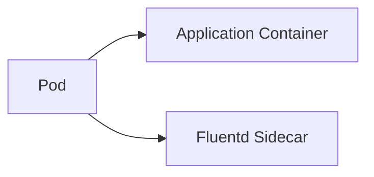

### Example YAML

```yaml
apiVersion: v1
kind: Pod
metadata:
  name: nginx-pod
spec:
  containers:
  - name: nginx
    image: nginx
```

---

## 56. Explain Pod Lifecycle Phases

### Answer

A Pod moves through multiple phases:

| Phase | Description |
|---------|------------|
| Pending | Waiting for scheduling/images |
| Running | Containers started |
| Succeeded | Completed successfully |
| Failed | Container terminated with error |
| Unknown | Node communication issue |

### Lifecycle

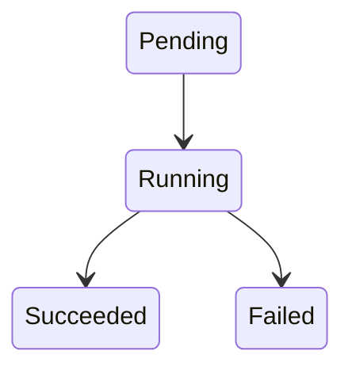

### Commands

```bash
kubectl get pods
kubectl describe pod nginx
```

---

## 57. Give a practical use case for running multiple containers inside a single Pod (Sidecar)

### Answer

A common example is:

- Application Container
- Fluentd/Filebeat Sidecar

Application writes logs.
Sidecar collects logs and forwards them to Elasticsearch.

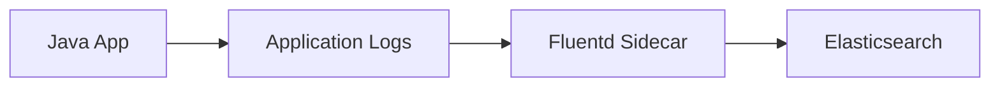

### Real Production Example

Banking Application Pod:

```text
Container 1 = Claims Service
Container 2 = Fluentd
```

---

## 58. What are Labels and Selectors, and why are they fundamental to Kubernetes?

### Answer

Labels are key-value pairs attached to objects.

Example:

```yaml
labels:
  app: frontend
  env: prod
```

Selectors use labels to find objects.

```yaml
selector:
  app: frontend
```

### Architecture

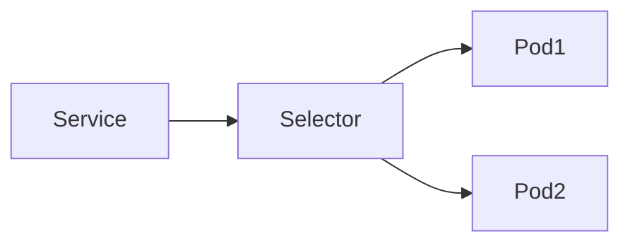

Without labels Services cannot find Pods.

---

## 59. What are Annotations, and how do they differ from Labels?

### Answer

| Labels | Annotations |
|----------|-----------|
| Used for selection | Not used for selection |
| Small metadata | Large metadata |
| Queryable | Not queryable |

### Example

```yaml
metadata:
  labels:
    app: frontend

  annotations:
    owner: devops-team
    build-number: "123"
```

### Diagram

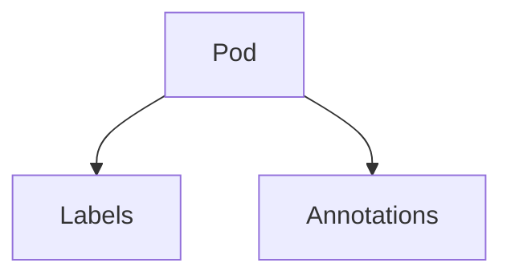

---

## 60. What is a ReplicaSet, and how does it differ from ReplicationController?

### Answer

ReplicaSet ensures the desired number of Pods are always running.

If one Pod crashes Kubernetes automatically creates another.

### Architecture

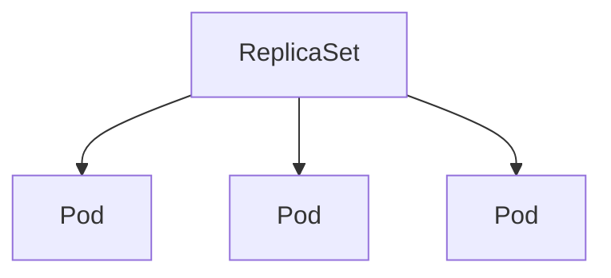

### Example YAML

```yaml
apiVersion: apps/v1
kind: ReplicaSet
spec:
  replicas: 3
```

### Difference

| ReplicaSet | ReplicationController |
|------------|----------------------|
| Set-based selectors | Equality selectors only |
| Modern | Legacy |

---

## 61. What is a Deployment object, and how does it manage ReplicaSets?

### Answer

Deployment is a higher-level controller that manages ReplicaSets.

Features:

- Rolling Updates
- Rollback
- Version History
- Self Healing

### Architecture

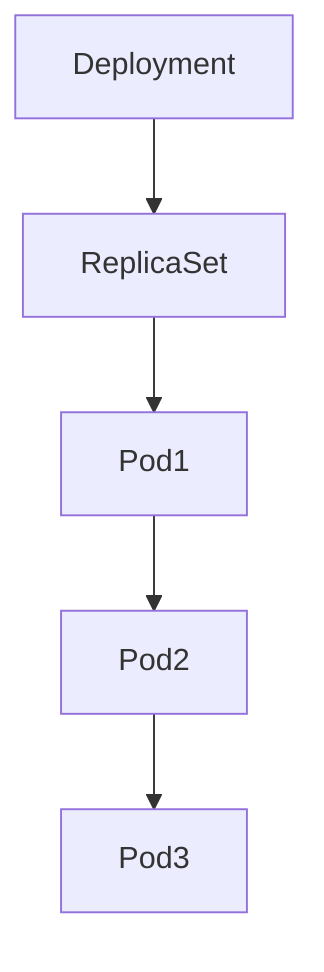

### Example YAML

```yaml
apiVersion: apps/v1
kind: Deployment
spec:
  replicas: 3
```

---

## 62. How do you execute a zero-downtime rolling update using Deployments?

### Answer

Deployment gradually replaces old Pods with new Pods.

### Rolling Update Flow

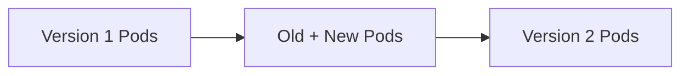

### Update Command

```bash
kubectl set image deployment/nginx \
nginx=nginx:1.26
```

### Monitor

```bash
kubectl rollout status deployment nginx
```

---

## 63. How do you rollback a Deployment to a previous stable version?

### Answer

View rollout history:

```bash
kubectl rollout history deployment nginx
```

Rollback:

```bash
kubectl rollout undo deployment nginx
```

### Diagram

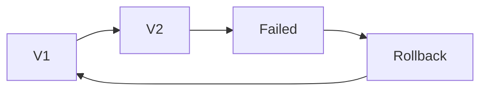

---

## 64. What is a StatefulSet, and when would you use it instead of a Deployment?

### Answer

StatefulSet is used for applications requiring:

- Stable hostname
- Persistent storage
- Ordered startup
- Ordered shutdown

### Examples

- MySQL
- PostgreSQL
- Kafka
- Elasticsearch
- MongoDB

### Architecture

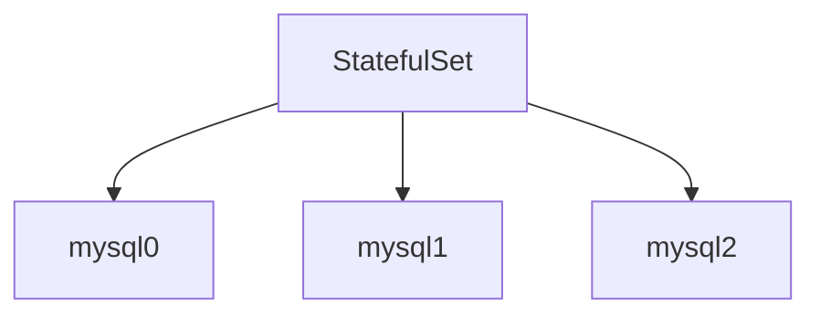

### Example YAML

```yaml
apiVersion: apps/v1
kind: StatefulSet
spec:
  serviceName: mysql
```

---

## 65. What is a DaemonSet? Provide a real-world logging or monitoring example.

### Answer

DaemonSet runs exactly one Pod on every node.

### Architecture

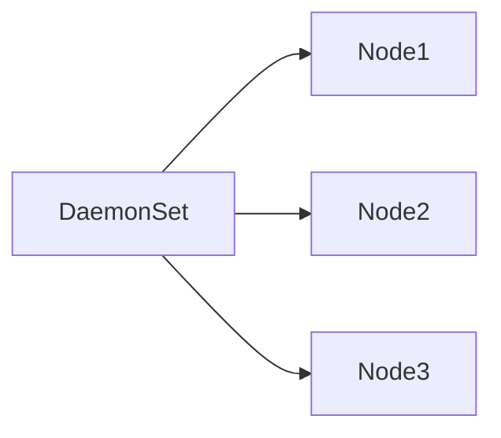

### Logging Example

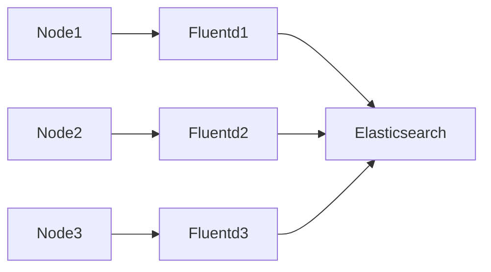

### Common DaemonSets

- Fluentd
- Filebeat
- Falco
- Node Exporter

---

## 66. What is the difference between a Job and a CronJob in Kubernetes?

### Answer

### Job

Runs once and exits.

Example:

```yaml
apiVersion: batch/v1
kind: Job
```

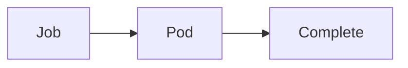

### CronJob

Runs on schedule.

Example:

```yaml
apiVersion: batch/v1
kind: CronJob
spec:
  schedule: "0 1 * * *"
```

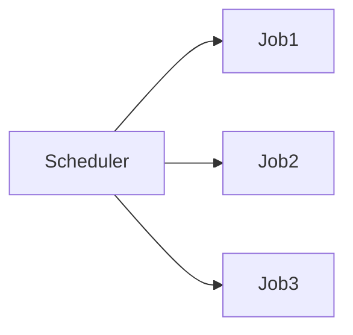

### Comparison

| Job | CronJob |
|------|---------|
| One-time | Scheduled |
| Manual | Automatic |
| Backup Now | Daily Backup |

---

# Quick Interview Summary

| Object | Purpose |
|----------|---------|
| Pod | Smallest deployment unit |
| ReplicaSet | Maintains Pod count |
| Deployment | Rolling updates and rollback |
| StatefulSet | Databases and stateful apps |
| DaemonSet | One pod per node |
| Job | Run once |
| CronJob | Scheduled execution |
