# Kubernetes Networking & Service Discovery (67–78) Interview Guide

## 67. How does the Kubernetes networking model ensure every Pod gets a unique IP?

### Answer
Kubernetes assigns every Pod its own IP address using a CNI plugin (Calico, Flannel, Cilium).

Key Rules:
- Every Pod gets a unique IP.
- Pods communicate directly without NAT.
- Pods on different nodes can communicate.

### Architecture

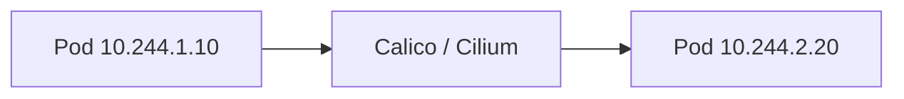

### Commands

```bash
kubectl get pods -o wide
```

---

## 68. What is a Kubernetes Service, and why is it necessary for Pod communication?

### Answer

Pods are temporary and their IPs change.

A Service provides:
- Stable IP
- Stable DNS Name
- Load Balancing

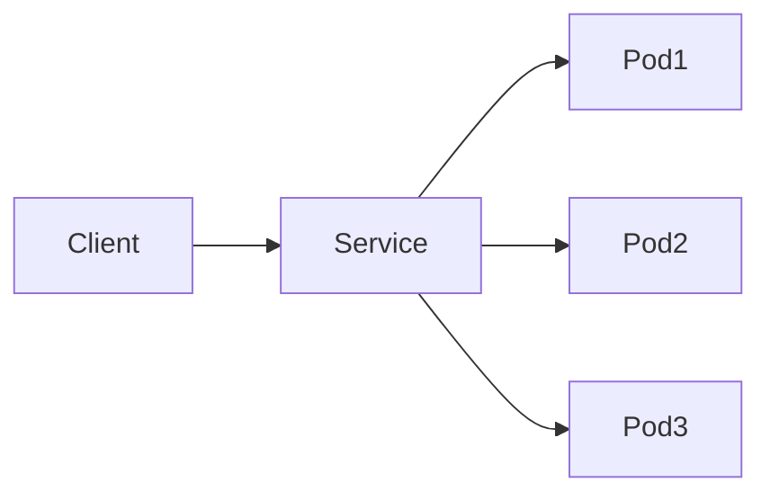

### Sample YAML

```yaml
apiVersion: v1
kind: Service
metadata:
  name: frontend
spec:
  selector:
    app: frontend
```

---

## 69. Explain the ClusterIP service type and its scope

### Answer

ClusterIP is the default service type.

Used for internal communication only.

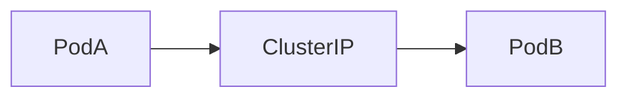

### Example

```yaml
spec:
  type: ClusterIP
```

Access:

```bash
curl http://service-name
```

---

## 70. Explain the NodePort service type and how it exposes traffic

### Answer

NodePort exposes an application using a port on every worker node.

Range:

```text
30000-32767
```

### Architecture

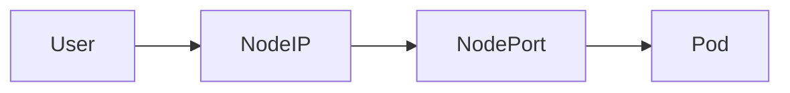

### YAML

```yaml
spec:
  type: NodePort
  ports:
  - port: 80
    nodePort: 30080
```

---

## 71. Explain the LoadBalancer service type in cloud environments

### Answer

LoadBalancer creates a cloud load balancer.

Examples:
- AWS ELB
- Azure LB
- GCP LB
- MetalLB (On-Prem)

### Architecture

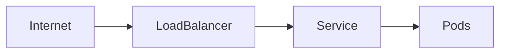

### YAML

```yaml
spec:
  type: LoadBalancer
```

---

## 72. What is a Headless Service (ClusterIP: None) and when is it used?

### Answer

Headless Service does not create a ClusterIP.

Used by:
- StatefulSets
- Databases
- Kafka

### Architecture

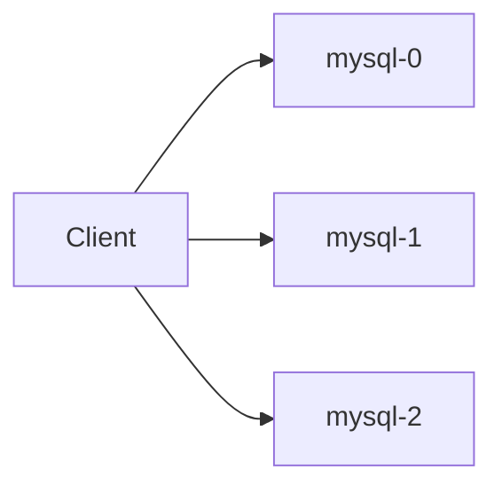

### YAML

```yaml
spec:
  clusterIP: None
```

---

## 73. What is an ExternalName service type?

### Answer

Maps a Kubernetes Service to an external DNS name.

### Architecture

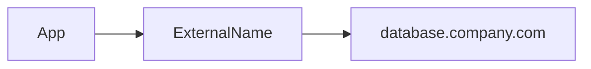

### YAML

```yaml
spec:
  type: ExternalName
  externalName: database.company.com
```

---

## 74. How does DNS resolution (CoreDNS) work internally for K8s Services?

### Answer

CoreDNS provides service discovery.

Flow:

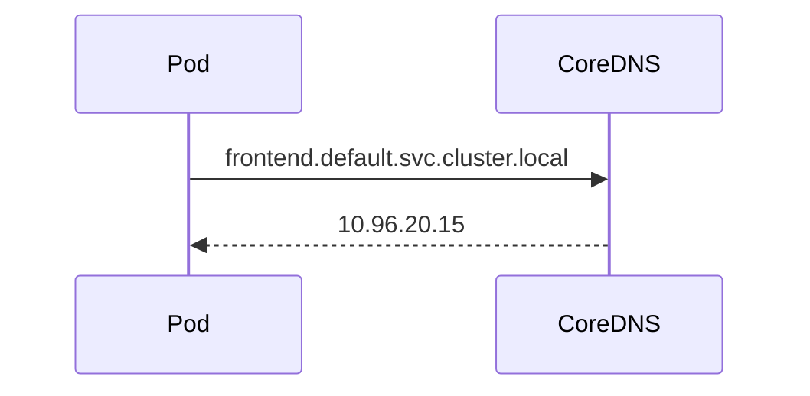

### Commands

```bash
kubectl get svc
kubectl get pods -n kube-system
```

Test DNS:

```bash
nslookup kubernetes.default
```

---

## 75. What is an Ingress and how does it differ from a LoadBalancer Service?

### Answer

Ingress provides Layer-7 routing.

LoadBalancer provides Layer-4 exposure.

### Architecture

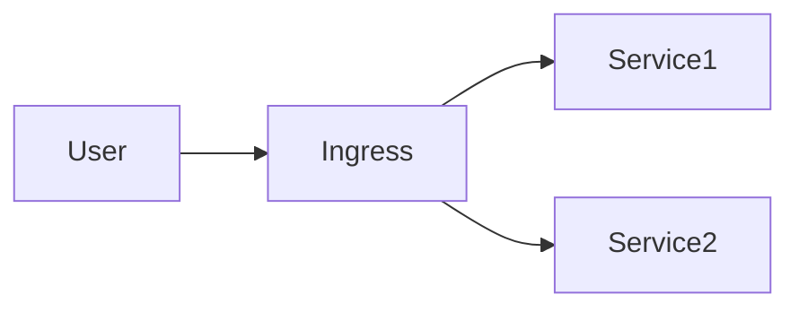

### Example

```yaml
kind: Ingress
```

### Comparison

| Ingress | LoadBalancer |
|----------|-------------|
| Layer 7 | Layer 4 |
| Host Routing | No Host Routing |
| Path Routing | No Path Routing |
| TLS Termination | Limited |

---

## 76. What is an Ingress Controller and why do you need one?

### Answer

Ingress resource alone does nothing.

Controller implements ingress rules.

Examples:
- NGINX Ingress
- Traefik
- HAProxy
- Kong

### Architecture

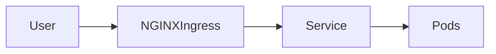

### Example

```bash
kubectl get ingress
kubectl get pods -n ingress-nginx
```

---

## 77. What are Network Policies and how do you restrict traffic?

### Answer

Network Policies act as Kubernetes firewalls.

Default:
- Allow all traffic

Network Policy:
- Allow specific traffic only

### Architecture

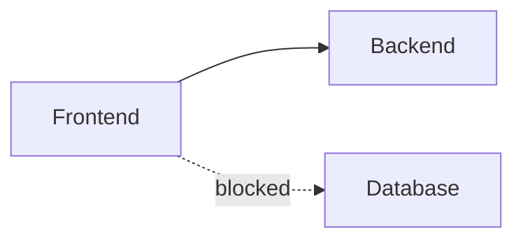

### Example

```yaml
kind: NetworkPolicy
```

---

## 78. How does kube-proxy manipulate iptables or IPVS to route traffic?

### Answer

kube-proxy watches Services and Endpoints.

It creates:
- iptables rules
- IPVS rules

to forward traffic.

### Architecture

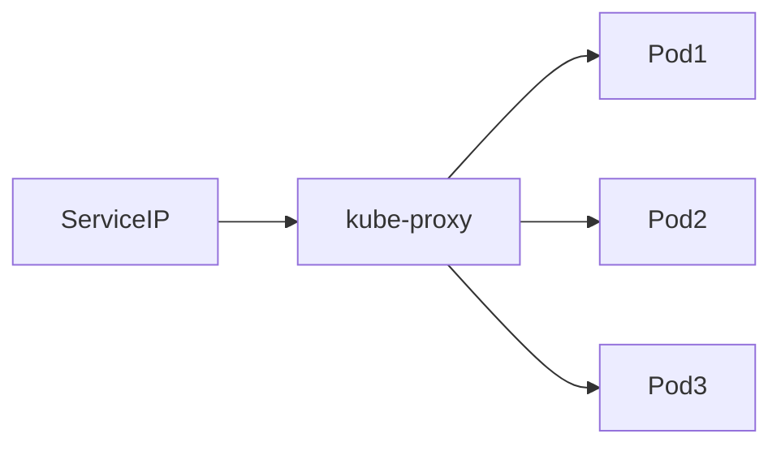

### Commands

```bash
iptables -t nat -L
ipvsadm -Ln
```

### Traffic Flow

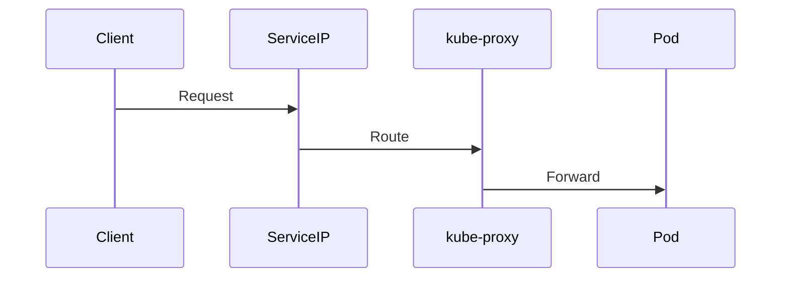

---

# Quick Interview Summary

| Object | Purpose |
|----------|---------|
| ClusterIP | Internal access |
| NodePort | External node access |
| LoadBalancer | Cloud LB |
| Headless Service | Stateful apps |
| ExternalName | External DNS |
| CoreDNS | Service discovery |
| Ingress | HTTP routing |
| Ingress Controller | Implements Ingress |
| Network Policy | Firewall |
| kube-proxy | Traffic routing |
