# Kubernetes Storage & Configuration Management (79–90) Interview Guide

## 79. What is an emptyDir volume, and when is its data destroyed?

### Answer
emptyDir is a temporary volume created when a Pod starts.

The data exists as long as the Pod exists.

Data is deleted when:
- Pod is deleted
- Pod is recreated on another node

### Architecture

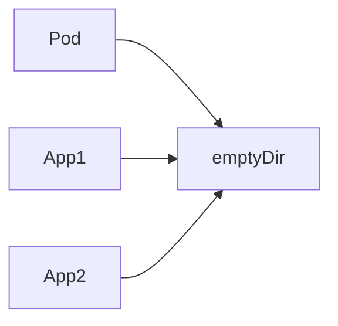

### Example YAML

```yaml
volumes:
- name: cache
  emptyDir: {}
```

### Use Cases
- Cache
- Temporary files
- Shared storage between containers

---

## 80. What is a hostPath volume, and what are its security risks?

### Answer

hostPath mounts a directory from the worker node into a Pod.

### Architecture

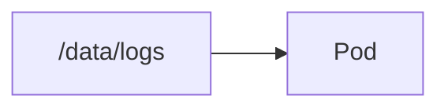

### YAML

```yaml
volumes:
- name: host-storage
  hostPath:
    path: /data/logs
```

### Risks

- Access to node filesystem
- Privilege escalation
- Data leakage
- Node dependency

### Production Recommendation

Avoid hostPath unless absolutely necessary.

---

## 81. Explain the difference between a Persistent Volume (PV) and a Persistent Volume Claim (PVC)

### Answer

PV = Actual storage resource

PVC = Storage request

### Architecture

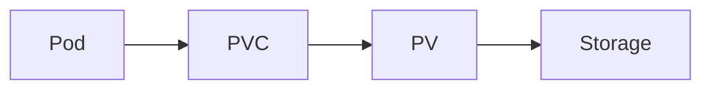

### Example

PV

```yaml
kind: PersistentVolume
```

PVC

```yaml
kind: PersistentVolumeClaim
```

### Analogy

PV = Apartment

PVC = Rental Agreement

---

## 82. What is a StorageClass, and how does it enable dynamic volume provisioning?

### Answer

StorageClass automatically provisions storage when a PVC is created.

### Architecture

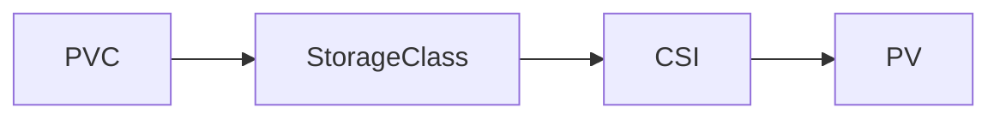

### Example YAML

```yaml
kind: StorageClass
provisioner: rook-ceph.rbd.csi.ceph.com
```

### Benefits

- Automatic PV creation
- Faster deployment
- Storage automation

---

## 83. What happens to a dynamically provisioned PV when its PVC is deleted?

### Answer

Behavior depends on Reclaim Policy.

### Policies

| Policy | Behavior |
|----------|----------|
| Delete | Remove storage |
| Retain | Keep storage |
| Recycle | Deprecated |

### Architecture

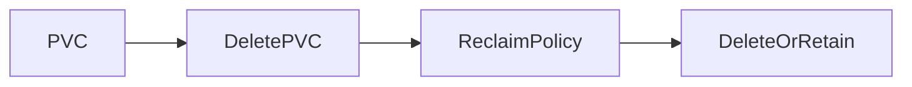

### Check Policy

```bash
kubectl get pv
```

---

## 84. What is the Container Storage Interface (CSI) in Kubernetes?

### Answer

CSI is the standard interface between Kubernetes and storage vendors.

### Architecture

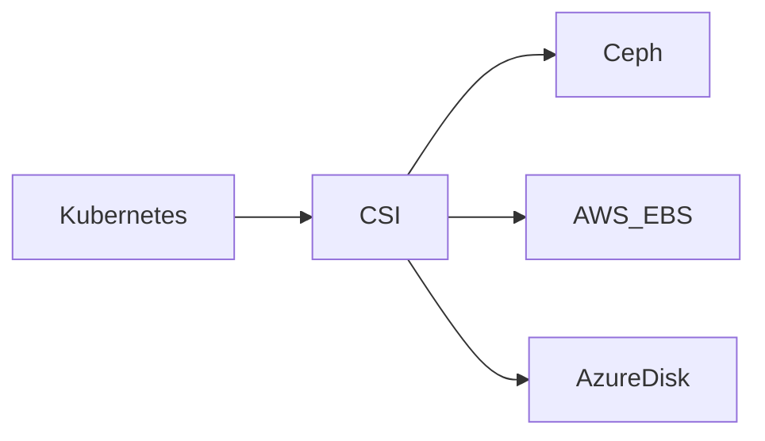

### Popular CSI Drivers

- Rook Ceph CSI
- AWS EBS CSI
- Azure Disk CSI
- GCP Persistent Disk CSI

---

# Configuration Management

## 85. What is a ConfigMap, and why should you decouple configuration from image code?

### Answer

ConfigMap stores application configuration outside container images.

### Architecture

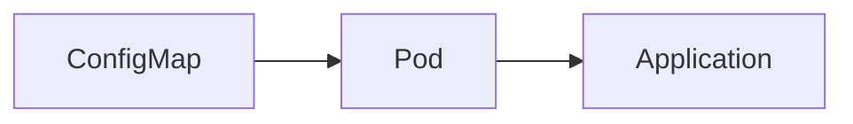

### Example YAML

```yaml
kind: ConfigMap
data:
  APP_ENV: prod
```

### Benefits

- Environment-specific configuration
- No image rebuild required

---

## 86. What are the different ways to inject a ConfigMap into a running Pod?

### Answer

Three common methods:

### Environment Variables

```yaml
envFrom:
- configMapRef:
    name: app-config
```

### Volume Mount

```yaml
volumes:
- configMap:
    name: app-config
```

### Command Arguments

```yaml
args:
- $(APP_ENV)
```

### Architecture

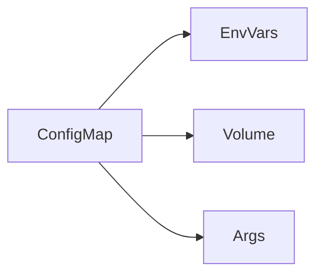

---

## 87. What are Kubernetes Secrets, and how do they differ from ConfigMaps?

### Answer

Secrets store sensitive data.

Examples:
- Passwords
- API Keys
- Certificates

### Comparison

| ConfigMap | Secret |
|------------|---------|
| Non-sensitive | Sensitive |
| Plain Text | Base64 Encoded |
| Config Data | Credentials |

### Architecture

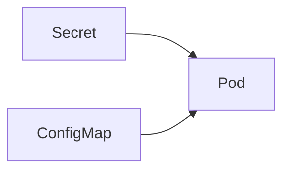

---

## 88. Are Kubernetes Secrets encrypted by default in etcd? How do you secure them?

### Answer

By default:

- Stored in etcd
- Base64 encoded
- Not encrypted

### Secure Secrets

1. Enable Encryption at Rest
2. Restrict RBAC
3. Use External Secret Store
4. Use Vault

### Architecture

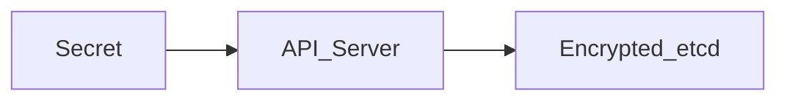

### Verify

```bash
kubectl get secret mysecret -o yaml
```

---

## 89. How do you update a ConfigMap dynamically without restarting the Pod?

### Answer

If mounted as a volume, Kubernetes automatically updates files.

### Architecture

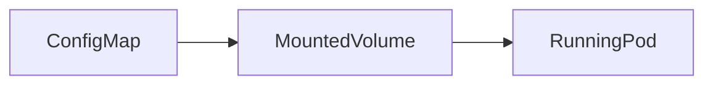

### Update

```bash
kubectl edit configmap app-config
```

### Important

Environment variables do NOT update automatically.

---

## 90. How do you pass a single key from a Secret as an environment variable?

### Example Secret

```yaml
kind: Secret
data:
  password: c2VjcmV0
```

### Pod YAML

```yaml
env:
- name: DB_PASSWORD
  valueFrom:
    secretKeyRef:
      name: db-secret
      key: password
```

### Architecture


---

# Quick Interview Summary

| Object | Purpose |
|----------|---------|
| emptyDir | Temporary Pod storage |
| hostPath | Node storage mount |
| PV | Actual storage |
| PVC | Storage request |
| StorageClass | Dynamic provisioning |
| CSI | Storage integration |
| ConfigMap | Application config |
| Secret | Sensitive data |
| Encryption at Rest | Secret security |
