# Kubernetes Security, Access Control & Auto Scaling (91–100) Interview Guide

## 91. What is Role-Based Access Control (RBAC) in Kubernetes?

### Answer
RBAC controls who can access Kubernetes resources and what actions they can perform.

RBAC uses:
- Users
- Groups
- Service Accounts
- Roles
- RoleBindings

### Architecture

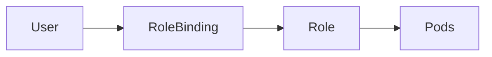

### Example Role

```yaml
apiVersion: rbac.authorization.k8s.io/v1
kind: Role
metadata:
  name: pod-reader
rules:
- apiGroups: [""]
  resources: ["pods"]
  verbs: ["get","list","watch"]
```

### Check Access

```bash
kubectl auth can-i get pods
```

---

## 92. Explain the exact difference between a Role and a ClusterRole

### Answer

| Role | ClusterRole |
|--------|------------|
| Namespace scoped | Cluster scoped |
| Access only within namespace | Access across cluster |
| Bound using RoleBinding | Bound using ClusterRoleBinding |

### Architecture

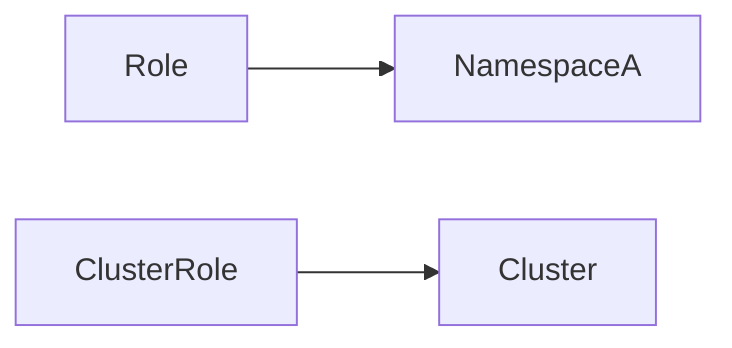

### Examples

```yaml
kind: Role
```

```yaml
kind: ClusterRole
```

### Production Example

Role:
- Finance namespace developer

ClusterRole:
- Kubernetes administrator

---

## 93. What is a ServiceAccount, and how do Pods use it to access the API?

### Answer

ServiceAccount provides an identity for Pods.

When a Pod starts:
- Kubernetes injects a token
- Pod authenticates to API Server

### Architecture

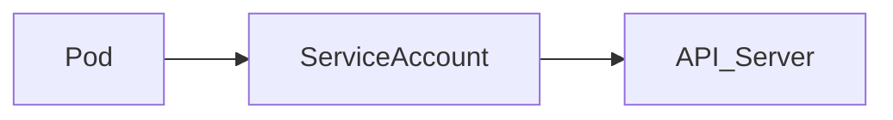

### Example

```yaml
apiVersion: v1
kind: ServiceAccount
metadata:
  name: app-sa
```

### Pod Example

```yaml
serviceAccountName: app-sa
```

---

## 94. What are Admission Controllers (e.g., Pod Security Admission)?

### Answer

Admission Controllers validate and modify requests before objects are stored.

Flow:

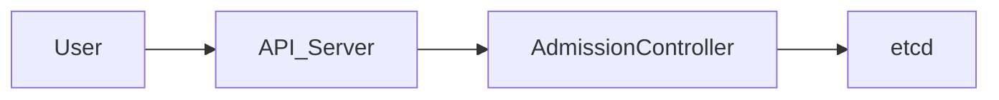

Examples:
- Pod Security Admission
- ResourceQuota
- LimitRanger
- MutatingWebhook

### Real Use Case

Prevent privileged containers from being created.

---

## 95. How do Taints and Tolerations work together to restrict Pod scheduling?

### Answer

Taints repel Pods.

Tolerations allow Pods to run on tainted nodes.

### Architecture

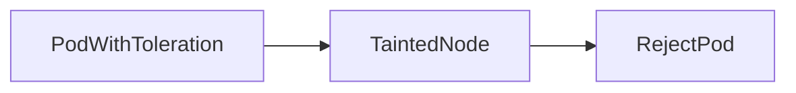

### Taint

```bash
kubectl taint nodes worker1 dedicated=db:NoSchedule
```

### Toleration

```yaml
tolerations:
- key: dedicated
  operator: Equal
  value: db
  effect: NoSchedule
```

### Production Example

Database workloads only on database nodes.

---

# Probes & Auto Scaling

## 96. Explain the difference between Liveness, Readiness, and Startup Probes

### Answer

| Probe | Purpose |
|---------|---------|
| Liveness | Is app alive? |
| Readiness | Can app accept traffic? |
| Startup | Has app finished startup? |

### Architecture

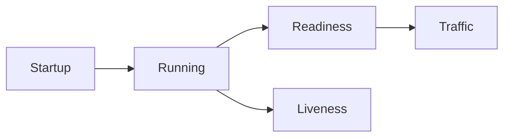

### Example

```yaml
livenessProbe:
  httpGet:
    path: /health
    port: 8080
```

---

## 97. What is Node Affinity, and how does it dictate where a Pod is scheduled?

### Answer

Node Affinity allows Pods to prefer or require specific nodes.

### Architecture

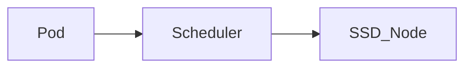

### Example

```yaml
affinity:
  nodeAffinity:
    requiredDuringSchedulingIgnoredDuringExecution:
```

### Production Example

Run database Pods only on SSD nodes.

---

## 98. How does the Horizontal Pod Autoscaler (HPA) scale workloads based on metrics?

### Answer

HPA changes replica count based on metrics.

Common Metrics:
- CPU
- Memory
- Custom Metrics

### Architecture

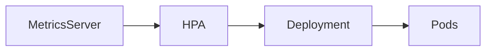

### Example

```yaml
apiVersion: autoscaling/v2
kind: HorizontalPodAutoscaler
```

### Check

```bash
kubectl get hpa
```

---

## 99. What is the Vertical Pod Autoscaler (VPA), and when would you use it over HPA?

### Answer

VPA changes CPU and Memory requests/limits.

### Architecture

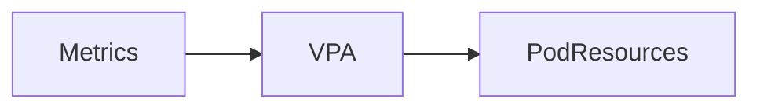

### Example

Before:

```text
CPU=500m
Memory=512Mi
```

After:

```text
CPU=2
Memory=2Gi
```

### HPA vs VPA

| HPA | VPA |
|------|-----|
| Adds Pods | Increases resources |
| Scales horizontally | Scales vertically |

---

## 100. How does the Cluster Autoscaler interact with cloud providers to add/remove nodes?

### Answer

Cluster Autoscaler adds or removes worker nodes.

### Scale Out

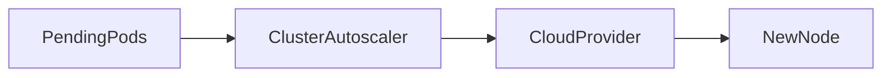

### Scale In

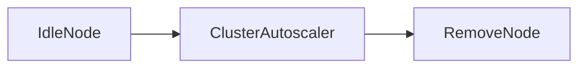

### Supported Platforms

- AWS ASG
- Azure VMSS
- GCP MIG
- EKS
- AKS
- GKE

### Commands

```bash
kubectl get nodes
kubectl get pods
```

---

# Quick Interview Summary

| Component | Purpose |
|------------|---------|
| RBAC | Authorization |
| Role | Namespace permissions |
| ClusterRole | Cluster permissions |
| ServiceAccount | Pod identity |
| Admission Controller | Request validation |
| Taints | Repel Pods |
| Tolerations | Allow Pods |
| Liveness Probe | Health check |
| Readiness Probe | Traffic check |
| Startup Probe | Startup validation |
| Node Affinity | Scheduling control |
| HPA | Scale Pods |
| VPA | Scale Resources |
| Cluster Autoscaler | Scale Nodes |
