# Docker Core Concepts (1-14) Interview Guide

This guide contains concise answers and Mermaid diagrams for all 14 Docker core concepts.

## 1. Docker vs VM

Docker shares the host OS; VMs run separate guest OSes.

## 2. Docker Architecture
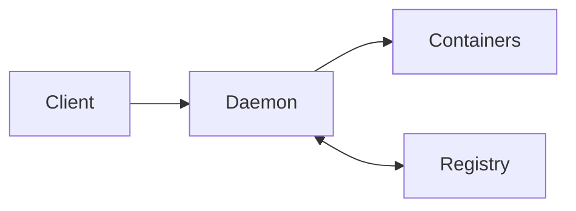

## 3. Image vs Container
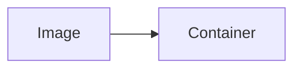
Image = template, Container = running instance.

## 4. Container Lifecycle
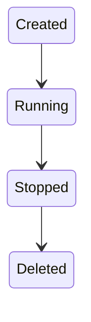

## 5. docker run Internals
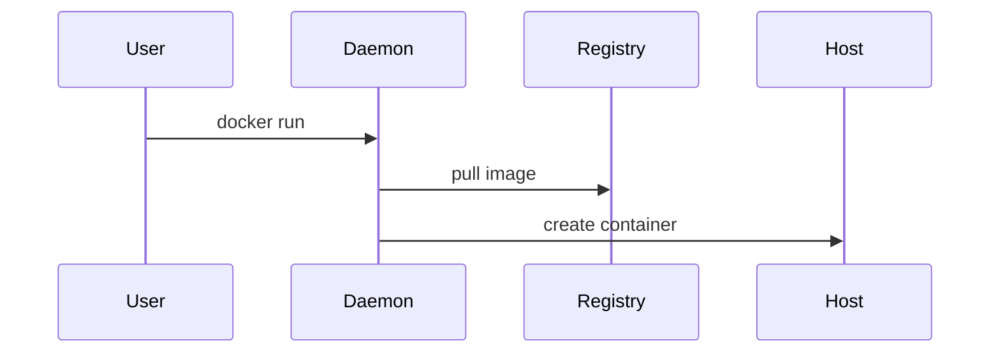

## 6. Namespaces
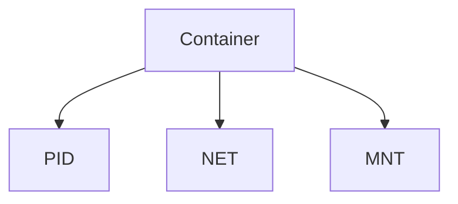
Isolation mechanism.

## 7. cgroups
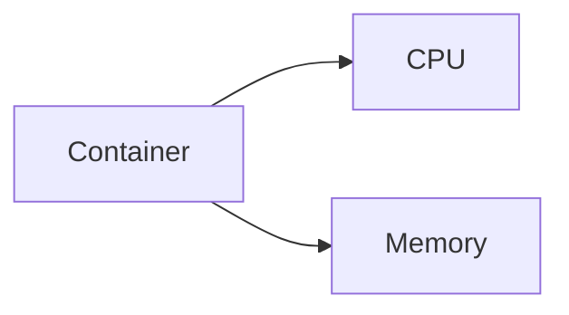
Resource limits.

## 8. Dockerfile
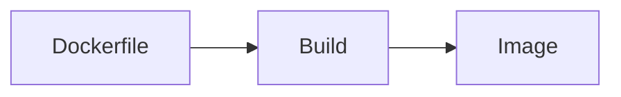

## 9. Layers and Cache
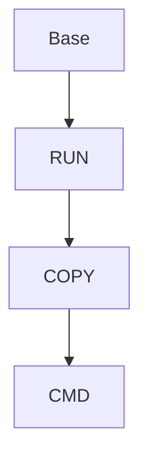

## 10. CMD vs ENTRYPOINT
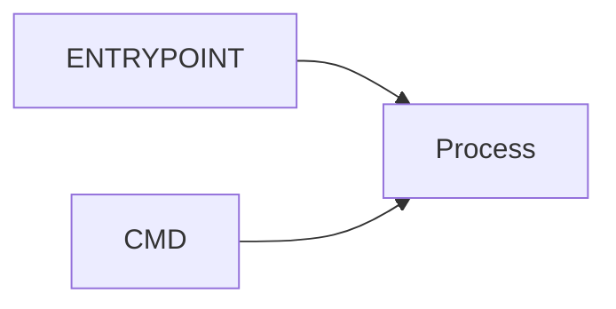

## 11. COPY vs ADD
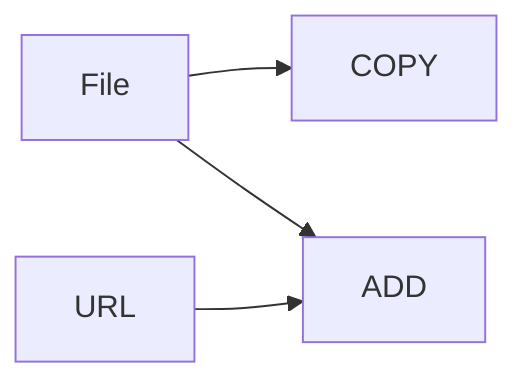

## 12. docker exec

## 13. CPU and Memory Limits
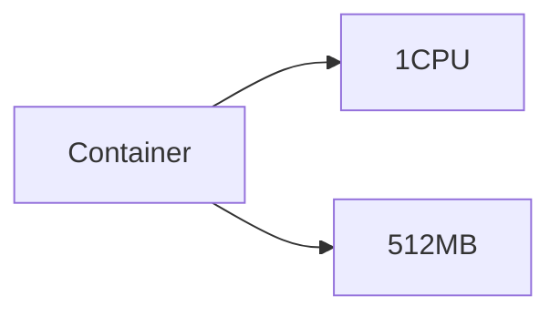

## 14. Container Logs
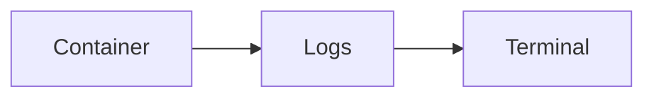
