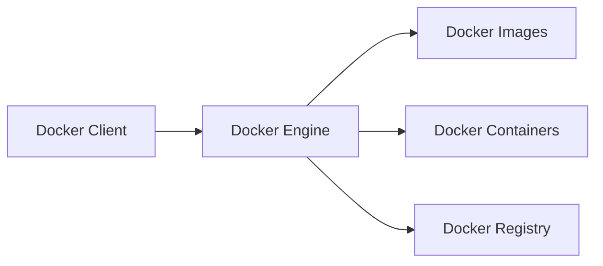
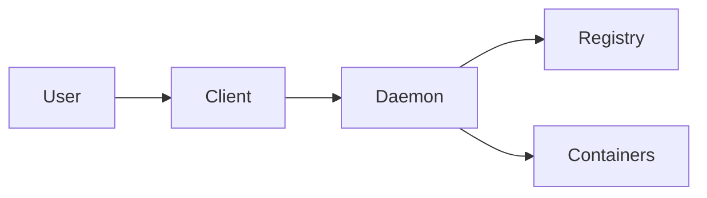
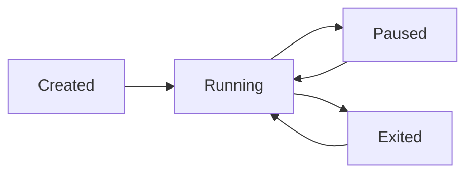
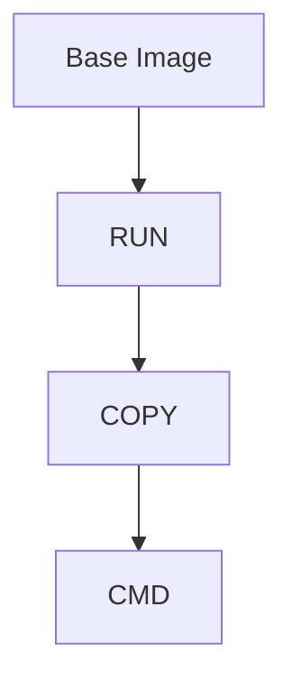

# Docker Core Concepts (1–14)


## 1. What is Docker and how does it fundamentally differ from a Virtual Machine?

**Answer:**

Docker is a containerization platform that packages applications and dependencies into lightweight containers.

| Docker Container | Virtual Machine |
|-----------------|----------------|
| Shares host OS kernel | Has its own guest OS |
| Lightweight | Heavyweight |
| Starts in seconds | Starts in minutes |
| Low resource usage | High resource usage |
| High density | Lower density |

---

## 2. Explain the core components of Docker Architecture (Client, Host, Daemon, Registry).

**Answer:**

- **Docker Client** – Executes docker commands.
- **Docker Host** – Machine running Docker.
- **Docker Daemon (dockerd)** – Manages images, containers, networks, volumes.
- **Docker Registry** – Stores Docker images.


---

## 3. What is the difference between a Docker Image and a Docker Container?

**Answer:**

| Docker Image | Docker Container |
|-------------|------------------|
| Read-only template | Running instance |
| Static | Dynamic |
| Built once | Created from image |
| Stored in registry | Runs on host |

Example:

```bash
docker build -t myapp:v1 .
docker run -d myapp:v1
```

---

## 4. Explain the lifecycle states of a Docker container.

**Answer:**

States:

1. Created
2. Running
3. Paused
4. Restarting
5. Exited
6. Dead


---

## 5. What happens internally when you execute the `docker run` command?

**Answer:**

1. Docker client sends request to daemon.
2. Image is checked locally.
3. Image is pulled if missing.
4. Container filesystem is created.
5. Network is configured.
6. Container process starts.

Example:

```bash
docker run -d nginx
```

---

## 6. How does Docker utilize Linux namespaces for isolation?

**Answer:**

Docker uses namespaces to isolate:

- PID
- Network
- Mount
- IPC
- UTS
- User

This ensures containers operate independently.

---

## 7. How does Docker utilize Linux cgroups for resource management?

**Answer:**

Cgroups control:

- CPU
- Memory
- Disk I/O
- Network bandwidth

Example:

```bash
docker run -m 512m --cpus=1 nginx
```

---

## 8. What is a Dockerfile, and what are its standard instructions?

**Answer:**

A Dockerfile contains instructions to build images.

Common Instructions:

- FROM
- RUN
- COPY
- ADD
- WORKDIR
- ENV
- EXPOSE
- CMD
- ENTRYPOINT

Example:

```dockerfile
FROM nginx
COPY index.html /usr/share/nginx/html
EXPOSE 80
CMD ["nginx","-g","daemon off;"]
```

---

## 9. Explain the concept of Docker image caching and layers.

**Answer:**

Each Dockerfile instruction creates a layer.

Benefits:

- Faster builds
- Reuse of unchanged layers
- Reduced storage consumption



---

## 10. What is the exact difference between CMD and ENTRYPOINT?

**Answer:**

| CMD | ENTRYPOINT |
|------|-----------|
| Default command | Fixed executable |
| Can be overridden | Harder to override |
| Provides arguments | Defines main process |

Example:

```dockerfile
ENTRYPOINT ["nginx"]
CMD ["-g","daemon off;"]
```

---

## 11. What is the difference between COPY and ADD in a Dockerfile?

**Answer:**

| COPY | ADD |
|--------|------|
| Copies local files | Copies local files |
| Simple and preferred | Additional functionality |
| No extraction | Auto extracts tar files |
| No URL support | Supports URLs |

Example:

```dockerfile
COPY app.jar /app/
ADD archive.tar.gz /app/
```

---

## 12. How do you execute commands inside a running container?

**Answer:**

Using `docker exec`.

Example:

```bash
docker exec -it nginx-container bash
```

Run a single command:

```bash
docker exec nginx-container ls -l
```

---

## 13. How do you limit the CPU and Memory usage of a specific container?

**Answer:**

Example:

```bash
docker run -d \
--memory=512m \
--cpus=1 \
nginx
```

Verify:

```bash
docker stats
```

---

## 14. How do you view real-time logs of a background container?

**Answer:**

View logs:

```bash
docker logs container-name
```

Real-time logs:

```bash
docker logs -f container-name
```

Last 100 lines:

```bash
docker logs --tail 100 container-name
```

---

# Quick Docker Interview Summary

- Docker = Containerization platform.
- Image = Blueprint.
- Container = Running image.
- Namespace = Isolation.
- Cgroups = Resource control.
- Dockerfile = Image build instructions.
- Registry = Image repository.
- CMD = Default command.
- ENTRYPOINT = Main executable.
- COPY = Simple file copy.
- ADD = Copy + extra features.
