# Kubernetes Core Concepts (55-66) Interview Guide

## 55. Pod
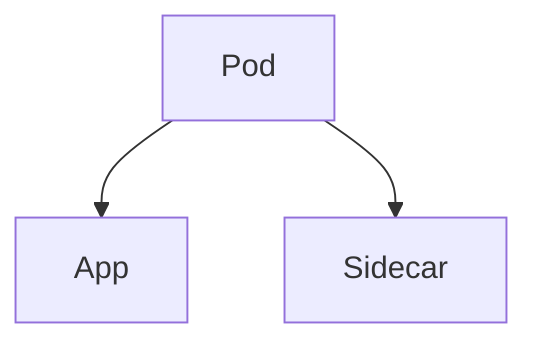
Pod is the smallest deployable unit in Kubernetes.

## 56. Pod Lifecycle
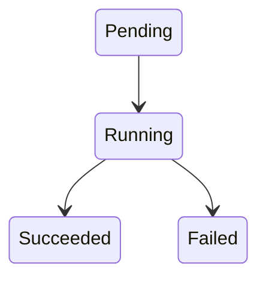

## 57. Sidecar Use Case
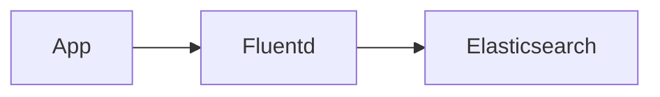

## 58. Labels and Selectors
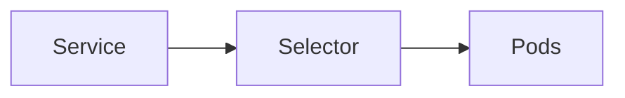

## 59. Labels vs Annotations
Labels are used for selection. Annotations store metadata.

## 60. ReplicaSet
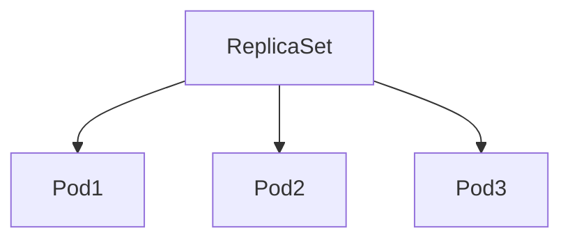

## 61. Deployment
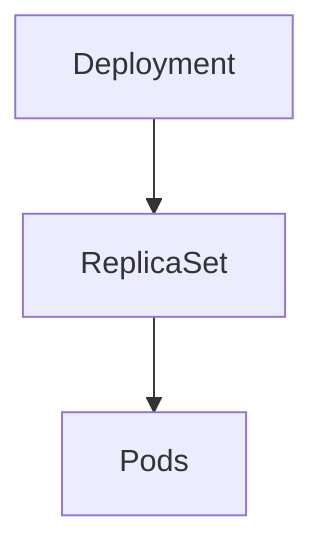

## 62. Rolling Update
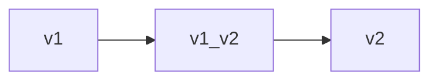

## 63. Rollback
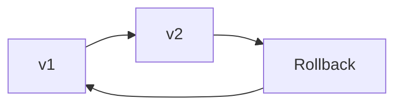

## 64. StatefulSet
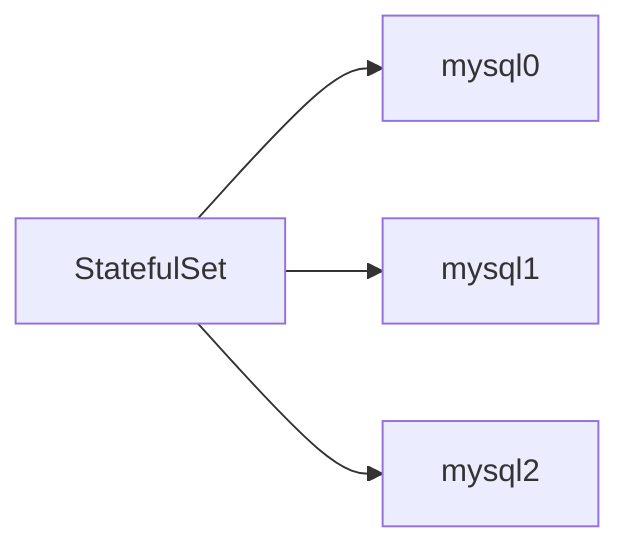

## 65. DaemonSet
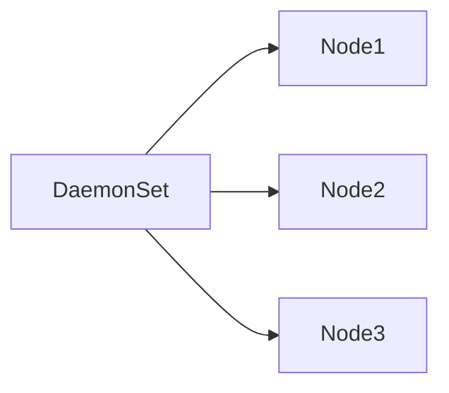

## 66. Job vs CronJob
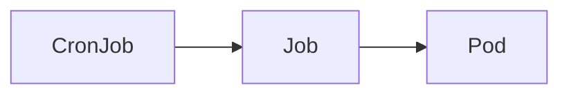
