# 100 Kubernetes Errors and How to Resolve Them


## First Page: Kubernetes Error Troubleshooting Architecture

```mermaid
flowchart TD
    START([Kubernetes Issue Reported]):::start --> CHECK{Start With kubectl get pods / nodes}:::decision

    CHECK --> PODS[Pod Problems]:::pod
    CHECK --> NODE[Node Problems]:::node
    CHECK --> NET[Network / DNS / Ingress]:::net
    CHECK --> STORAGE[Storage / PVC / PV]:::storage
    CHECK --> SEC[Security / RBAC / Secret]:::security
    CHECK --> SCALE[Scaling / Metrics]:::scale
    CHECK --> CONTROL[Control Plane / API / Certs]:::control

    PODS --> P1[CrashLoopBackOff: check logs and app config]:::fix
    PODS --> P2[ImagePullBackOff: check image, tag, registry secret]:::fix
    PODS --> P3[Pending / Init / Terminating: check events, resources, finalizers]:::fix

    NODE --> N1[NotReady / DiskPressure / Unreachable: check kubelet, disk, memory, network]:::fix
    NODE --> N2[Evicted Pods: free resources or add capacity]:::fix

    NET --> NW1[Service not reachable: check service, selectors, endpoints]:::fix
    NET --> NW2[DNS failure: check CoreDNS and kube-dns]:::fix
    NET --> NW3[Ingress 404/502/TLS/Loop: check rules, service ports, TLS secret]:::fix
    NET --> NW4[NetworkPolicy blocking: allow required ingress/egress]:::fix

    STORAGE --> S1[PVC Pending/Lost: check StorageClass and backend]:::fix
    STORAGE --> S2[FailedAttachVolume / Mount Permission: check volume attach and securityContext]:::fix

    SEC --> R1[Forbidden: check Role, RoleBinding, ClusterRoleBinding]:::fix
    SEC --> R2[Unauthorized: check token, kubeconfig, certificates]:::fix
    SEC --> R3[Secret/ConfigMap missing: create or mount correctly]:::fix

    SCALE --> A1[HPA not scaling: check metrics-server and resource requests]:::fix
    SCALE --> A2[Autoscaler slow/not adding nodes: check node pool limits and permissions]:::fix

    CONTROL --> CP1[API refused/timeout/high latency: check apiserver and etcd]:::fix
    CONTROL --> CP2[Certificate expired/rotation failing: renew certificates]:::fix
    CONTROL --> CP3[Upgrade failure: validate versions and kubeadm plan]:::fix

    classDef start fill:#c7f9cc,stroke:#2d6a4f,stroke-width:2px,color:#000;
    classDef decision fill:#fff3b0,stroke:#b08900,stroke-width:2px,color:#000;
    classDef pod fill:#ffd6a5,stroke:#cc5803,stroke-width:2px,color:#000;
    classDef node fill:#bde0fe,stroke:#0077b6,stroke-width:2px,color:#000;
    classDef net fill:#cdb4db,stroke:#6a4c93,stroke-width:2px,color:#000;
    classDef storage fill:#ffc8dd,stroke:#c9184a,stroke-width:2px,color:#000;
    classDef security fill:#ffadad,stroke:#d00000,stroke-width:2px,color:#000;
    classDef scale fill:#d8f3dc,stroke:#40916c,stroke-width:2px,color:#000;
    classDef control fill:#caf0f8,stroke:#023e8a,stroke-width:2px,color:#000;
    classDef fix fill:#e9ecef,stroke:#495057,stroke-width:1px,color:#000;
```




## Table of Contents

- [Error 1: CrashLoopBackOff Error](#error-1-crashloopbackoff-error)
- [Error 2: ImagePullBackOff](#error-2-imagepullbackoff)
- [Error 3: Pending Pods](#error-3-pending-pods)
- [Error 4: Node Not Ready](#error-4-node-not-ready)
- [Error 5: Evicted Pods](#error-5-evicted-pods)
- [Error 6: Pod Stuck in Terminating State](#error-6-pod-stuck-in-terminating-state)
- [Error 7: Service Not Accessible](#error-7-service-not-accessible)
- [Error 8: Ingress Not Working](#error-8-ingress-not-working)
- [Error 9: ConfigMap Not Found](#error-9-configmap-not-found)
- [Error 10: Secrets Not Accessible](#error-10-secrets-not-accessible)
- [Error 11: Pod Cannot Access PersistentVolume](#error-11-pod-cannot-access-persistentvolume)
- [Error 12: Pod Fails Readiness Probe](#error-12-pod-fails-readiness-probe)
- [Error 13: Node Disk Pressure](#error-13-node-disk-pressure)
- [Error 14: Unauthorized Error When Accessing Kubernetes API](#error-14-unauthorized-error-when-accessing-kubernetes-api)
- [Error 15: HPA (Horizontal Pod Autoscaler) Not Scaling](#error-15-hpa-horizontal-pod-autoscaler-not-scaling)
- [Error 16: Service Not Resolving DNS](#error-16-service-not-resolving-dns)
- [Error 17: PVC in Lost State](#error-17-pvc-in-lost-state)
- [Error 18: ClusterRoleBinding Missing Permissions](#error-18-clusterrolebinding-missing-permissions)
- [Error 19: Pod Status Unknown](#error-19-pod-status-unknown)
- [Error 20: DaemonSet Not Deploying Pods on All Nodes](#error-20-daemonset-not-deploying-pods-on-all-nodes)
- [Error 21: Error: The connection to the server was refused](#error-21-error-the-connection-to-the-server-was-refused)
- [Error 22: Pods Stuck in ContainerCreating State](#error-22-pods-stuck-in-containercreating-state)
- [Error 23: RBAC Permission Denied Error](#error-23-rbac-permission-denied-error)
- [Error 24: Pod IP Not Reachable](#error-24-pod-ip-not-reachable)
- [Error 25: Kubelet Service Not Running](#error-25-kubelet-service-not-running)
- [Error 26: Deployment Not Updating](#error-26-deployment-not-updating)
- [Error 27: FailedAttachVolume](#error-27-failedattachvolume)
- [Error 28: Namespace Deletion Stuck](#error-28-namespace-deletion-stuck)
- [Error 29: Pods Stuck in Init State](#error-29-pods-stuck-in-init-state)
- [Error 30: Ingress Shows 404](#error-30-ingress-shows-404)
- [Error 31: Invalid Memory/CPU Requests](#error-31-invalid-memorycpu-requests)
- [Error 32: Service NodePort Not Accessible](#error-32-service-nodeport-not-accessible)
- [Error 33: Pods Not Being Scheduled](#error-33-pods-not-being-scheduled)
- [Error 34: Pod Cannot Connect to External Services](#error-34-pod-cannot-connect-to-external-services)
- [Error 35: Deployment Not Scaling Properly](#error-35-deployment-not-scaling-properly)
- [Error 36: Cluster Autoscaler Not Adding Nodes](#error-36-cluster-autoscaler-not-adding-nodes)
- [Error 37: API Server Timeout](#error-37-api-server-timeout)
- [Error 38: Pod Cannot Access ConfigMap](#error-38-pod-cannot-access-configmap)
- [Error 39: DaemonSet Pods Not Deploying](#error-39-daemonset-pods-not-deploying)
- [Error 40: Pods Cannot Pull Secrets](#error-40-pods-cannot-pull-secrets)
- [Error 41: Service External-IP Pending](#error-41-service-external-ip-pending)
- [Error 42: Pod Terminated With Exit Code 137](#error-42-pod-terminated-with-exit-code-137)
- [Error 43: Failed to Start Pod Sandbox](#error-43-failed-to-start-pod-sandbox)
- [Error 44: Helm Release Stuck in PENDING_INSTALL](#error-44-helm-release-stuck-in-pendinginstall)
- [Error 45: Ingress Returning 502 Bad Gateway](#error-45-ingress-returning-502-bad-gateway)
- [Error 46: Error: context deadline exceeded](#error-46-error-context-deadline-exceeded)
- [Error 47: Volume Mount Permissions Denied](#error-47-volume-mount-permissions-denied)
- [Error 48: Pods Exceeding Resource Quota](#error-48-pods-exceeding-resource-quota)
- [Error 49: Cluster Certificate Expired](#error-49-cluster-certificate-expired)
- [Error 50: HPA Not Responding to Metrics](#error-50-hpa-not-responding-to-metrics)
- [Error 51: Pod IP Conflict](#error-51-pod-ip-conflict)
- [Error 52: Service Account Not Found](#error-52-service-account-not-found)
- [Error 53: Pod Fails Liveness Probe](#error-53-pod-fails-liveness-probe)
- [Error 54: Cannot Delete Namespace](#error-54-cannot-delete-namespace)
- [Error 55: Cannot Access API from External Client](#error-55-cannot-access-api-from-external-client)
- [Error 56: Ingress Controller Pods CrashLooping](#error-56-ingress-controller-pods-crashlooping)
- [Error 57: Kubelet Certificate Rotation Failing](#error-57-kubelet-certificate-rotation-failing)
- [Error 58: Metrics Server Shows No Data](#error-58-metrics-server-shows-no-data)
- [Error 59: DNS Resolution Intermittent](#error-59-dns-resolution-intermittent)
- [Error 60: Pod Cannot Access PersistentVolume](#error-60-pod-cannot-access-persistentvolume)
- [Error 61: Error: Forbidden when Running kubectl Commands](#error-61-error-forbidden-when-running-kubectl-commands)
- [Error 62: Node Cannot Join Cluster](#error-62-node-cannot-join-cluster)
- [Error 63: API Server High Latency](#error-63-api-server-high-latency)
- [Error 64: DaemonSet Pods Not Running on Specific Node](#error-64-daemonset-pods-not-running-on-specific-node)
- [Error 65: Service Not Forwarding Traffic](#error-65-service-not-forwarding-traffic)
- [Error 66: Error: Unauthorized when Accessing API Server](#error-66-error-unauthorized-when-accessing-api-server)
- [Error 67: Pod Logs Not Available](#error-67-pod-logs-not-available)
- [Error 68: Cannot Delete Stuck Pod](#error-68-cannot-delete-stuck-pod)
- [Error 69: Pods Restarting Frequently](#error-69-pods-restarting-frequently)
- [Error 70: Cluster Nodes Unreachable](#error-70-cluster-nodes-unreachable)
- [Error 71: Pods Stuck in ImagePullBackOff](#error-71-pods-stuck-in-imagepullbackoff)
- [Error 72: Node Disk Pressure Causes Pod Evictions](#error-72-node-disk-pressure-causes-pod-evictions)
- [Error 73: Pod Cannot Access Secret](#error-73-pod-cannot-access-secret)
- [Error 74: PVC Pending Due to StorageClass Issues](#error-74-pvc-pending-due-to-storageclass-issues)
- [Error 75: Cannot Scale Deployment Beyond Node Capacity](#error-75-cannot-scale-deployment-beyond-node-capacity)
- [Error 76: CoreDNS Pods CrashLooping](#error-76-coredns-pods-crashlooping)
- [Error 77: HPA Not Responding to Custom Metrics](#error-77-hpa-not-responding-to-custom-metrics)
- [Error 78: Pod Scheduling Ignored Node Selector](#error-78-pod-scheduling-ignored-node-selector)
- [Error 79: Ingress SSL/TLS Configuration Fails](#error-79-ingress-ssltls-configuration-fails)
- [Error 80: Kube-proxy Failing](#error-80-kube-proxy-failing)
- [Error 81: Cluster Autoscaler Scaling Too Slowly](#error-81-cluster-autoscaler-scaling-too-slowly)
- [Error 82: Pod Logs Truncated](#error-82-pod-logs-truncated)
- [Error 83: Pods Stuck in Evicted State](#error-83-pods-stuck-in-evicted-state)
- [Error 84: Pod Cannot Access Cluster Internal DNS](#error-84-pod-cannot-access-cluster-internal-dns)
- [Error 85: PersistentVolume Stuck in Released State](#error-85-persistentvolume-stuck-in-released-state)
- [Error 86: Job Failing to Complete](#error-86-job-failing-to-complete)
- [Error 87: ConfigMap Too Large](#error-87-configmap-too-large)
- [Error 88: Services Intermittently Unreachable](#error-88-services-intermittently-unreachable)
- [Error 89: Error: Connection Refused When Accessing Service](#error-89-error-connection-refused-when-accessing-service)
- [Error 90: Cluster High CPU Usage](#error-90-cluster-high-cpu-usage)
- [Error 91: Pod Stuck in Pending Due to Node Affinity](#error-91-pod-stuck-in-pending-due-to-node-affinity)
- [Error 92: Control Plane Components Not Starting](#error-92-control-plane-components-not-starting)
- [Error 93: Pods Stuck in Terminating State](#error-93-pods-stuck-in-terminating-state)
- [Error 94: Cluster Upgrade Fails](#error-94-cluster-upgrade-fails)
- [Error 95: Network Policy Blocking Traffic](#error-95-network-policy-blocking-traffic)
- [Error 96: Pods Stuck in Unknown State](#error-96-pods-stuck-in-unknown-state)
- [Error 97: PersistentVolume Not Resizing](#error-97-persistentvolume-not-resizing)
- [Error 98: Ingress Redirect Loop](#error-98-ingress-redirect-loop)
- [Error 99: Pod Security Context Misconfiguration](#error-99-pod-security-context-misconfiguration)
- [Error 100: Pods Overloaded Due to Missing HPA](#error-100-pods-overloaded-due-to-missing-hpa)

## Introduction

Kubernetes is the industry-standard platform for container orchestration, providing powerful capabilities for deploying, scaling, and managing modern applications. While Kubernetes offers exceptional flexibility and automation, troubleshooting issues in a production environment can be complex due to the interaction between containers, networking, storage, security, scheduling, and cluster infrastructure.

This guide presents 100 common Kubernetes errors and their solutions, covering a wide range of real-world operational scenarios encountered by DevOps engineers, Site Reliability Engineers (SREs), Platform Engineers, Cloud Engineers, and Kubernetes Administrators.


## 10 Most Important Things to Check for Diagnosing Kubernetes Errors

| # | Category | What to Check | Command / Action |
|---:|---|---|---|
| 1 | Pod Status | Verify if the pod is running, pending, or failed. | `kubectl get pods` |
| 2 | Pod Events | Check detailed event information. | `kubectl describe pod <pod-name>` |
| 3 | Pod Logs | Review application/runtime logs. | `kubectl logs <pod-name>` |
| 4 | Node Status | Verify node health. | `kubectl get nodes` |
| 5 | Node Resources | Check CPU, memory, and disk resources. | `kubectl describe node <node-name>` |
| 6 | Service Endpoints | Verify service endpoint mapping. | `kubectl get endpoints <service-name>` |
| 7 | Image Availability | Check image pull errors. | `kubectl describe pod <pod-name>` |
| 8 | Resource Quotas | Check namespace quotas. | `kubectl describe namespace <namespace-name>` |
| 9 | PersistentVolumes | Verify PVC/PV status. | `kubectl get pvc` |
| 10 | Ingress Rules | Check ingress and backend routing. | `kubectl describe ingress <ingress-name>` |


## Kubernetes Error Scenarios

## Error 1: CrashLoopBackOff Error

### Cause

The container is unable to start successfully and keeps restarting.

### Solution

1. Check the logs of the failing pod to identify the
issue. Example:
```bash
kubectl logs <pod-name>
```
2. Review the logs to understand the root cause of the issue.
Common reasons include application misconfiguration, missing environment variables, or incorrect startup commands.
3. Verify that the container image is built and pushed correctly to
the registry.
Example:
```bash
docker build -t <image-name> .
docker push <image-name>
```
4. If environment variables are missing, update the
deployment configuration.
Example:
Edit the deployment using:
```bash
kubectl edit deployment <deployment-name>
```
Add the missing environment variables under the env section.

---

## Error 2: ImagePullBackOff

### Cause

Kubernetes is unable to pull the container image from the registry.

### Solution

1. Check the pod description to identify the error
details. Example:
```bash
kubectl describe pod <pod-name>
```
2. Verify the image name and tag in your deployment configuration.
Ensure the image exists in the registry.
3. Authenticate with the container registry if required. For
private
registries, create a secret and link it to your deployment:
Example:
Create a secret:
```bash
kubectl create secret docker-registry <secret-name> --docker-server=<registry-server> --docker-username=<username> --docker-password=<password>
```
Update the deployment to use the secret:
```bash
kubectl edit deployment <deployment-name>
```
Add the secret under the imagePullSecrets section.

---

## Error 3: Pending Pods

### Cause

The pod remains in a Pending state because Kubernetes cannot schedule it.

### Solution

1. Check the pod's events for scheduling
details. Example:
```bash
kubectl describe pod <pod-name>
```
2. If insufficient resources are the issue, verify node capacity and
usage. Example:
```bash
kubectl get nodes
kubectl describe node <node-name>
```
3. Adjust the resource requests and limits in your
deployment. Example:
Edit the deployment:
```bash
kubectl edit deployment <deployment-name>
```
Modify the resources section under containers.
4. If there are no matching nodes for affinity/anti-affinity rules, update
or remove the rules.

---

## Error 4: Node Not Ready

### Cause

A node is in a NotReady state due to issues like disk pressure, memory pressure, or network problems.

### Solution

1. Check the status of the
nodes. Example:
```bash
kubectl get nodes
```
2. Describe the problematic node to find the
cause. Example:
```bash
kubectl describe node <node-name>
```
3. Address the specific issue:
- If disk pressure is mentioned, free up disk space.
- If memory pressure is mentioned, reduce resource
consumption or increase node capacity.
4. Restart the kubelet service on the affected node if necessary.

---

## Error 5: Evicted Pods

### Cause

Pods are evicted due to insufficient resources on the node.

### Solution

1. Identify the evicted pod and
reason. Example:
```bash
kubectl get pods
kubectl describe pod <pod-name>
```
2. Free up resources on the node by terminating unused pods or
increasing node capacity.
3. Add more nodes to the cluster if resource requirements
consistently exceed availability.
4. Adjust resource requests and limits in
deployments. Example:
Edit the deployment:
```bash
kubectl edit deployment <deployment-name>
```
Modify the resources section under containers.

---

## Error 6: Pod Stuck in Terminating State

### Cause

The pod cannot terminate properly, often due to hanging processes or stuck volumes.

### Solution

1. Check the pod details and reason for termination
delay. Example:
```bash
kubectl get pods
```
2. If the pod is stuck, force-delete
it. Example:
```bash
kubectl delete pod <pod-name> --grace-period=0 --force
```
3. Investigate the application or volumes to identify the root cause.
4. Update the terminationGracePeriodSeconds in the deployment to
allow graceful shutdown.
Example:
```bash
kubectl edit deployment <deployment-name>
```
Modify the terminationGracePeriodSeconds value.

---

## Error 7: Service Not Accessible

### Cause

The service is not exposing the application correctly.

### Solution

1. Check the service
details. Example:
```bash
kubectl get services
```
2. Verify the service
configuration. Example:
```bash
kubectl describe service <service-name>
```
3. Ensure the target port matches the container's exposed port.
4. If using a NodePort or LoadBalancer service, ensure that the
firewall allows traffic on the specified port.
5. Test the service using a temporary
pod. Example:
```bash
kubectl run test-pod --image=busybox --rm -it -- /bin/sh
```
Use curl to test the service from inside the cluster.

---

## Error 8: Ingress Not Working

### Cause

Ingress is not routing traffic to the backend services.

### Solution

1. Verify the ingress
configuration. Example:
```bash
kubectl describe ingress <ingress-name>
```
2. Check the ingress controller logs for errors.
3. Ensure the DNS is pointing to the ingress IP.
4. Verify that the backend services are correctly configured and accessible.
5. Restart the ingress controller if necessary.

---

## Error 9: ConfigMap Not Found

### Cause

The ConfigMap referenced in a pod or deployment does not exist.

### Solution

1. Verify the ConfigMap name in the
deployment. Example:
```bash
kubectl describe pod <pod-name>
```
2. Check the existing
ConfigMaps. Example:
```bash
kubectl get configmaps
```
3. Create the missing
ConfigMap. Example:
```bash
kubectl create configmap <configmap-name> --from-literal=<key>=<value>
```
4. Restart the affected deployment to apply the
changes. Example:
```bash
kubectl rollout restart deployment <deployment-name>
```

---

## Error 10: Secrets Not Accessible

### Cause

The secret is not accessible to the pod.

### Solution

1. Verify the secret is created and
accessible. Example:
```bash
kubectl get secrets
```
2. Check if the secret is mounted in the
pod. Example:
```bash
kubectl describe pod <pod-name>
```
3. Update the deployment to mount the
secret. Example:
Edit the deployment:
```bash
kubectl edit deployment <deployment-name>
```
Add the secret under envFrom or volumeMounts.

---

## Error 11: Pod Cannot Access PersistentVolume

### Cause

The PersistentVolume (PV) or PersistentVolumeClaim (PVC) is not properly bound.

### Solution

1. Verify the PVC
status. Example:
```bash
kubectl get pvc
```
2. If the PVC is in a Pending state, describe it to see the reason.
Example:
```bash
kubectl describe pvc <pvc-name>
```
3. Ensure the storage class and volume configuration match the
PVC request.
Example:
Update the storage class or create a matching PV using:
```bash
kubectl apply -f <pv-definition.yaml>
```
4. Check the pod's volume configuration and ensure the PVC is
referenced correctly.

---

## Error 12: Pod Fails Readiness Probe

### Cause

The application is not passing the readiness probe checks.

### Solution

1. Check the pod events for readiness probe
failures. Example:
```bash
kubectl describe pod <pod-name>
```
2. Review the readiness probe configuration in the
deployment. Example:
Edit the deployment:
```bash
kubectl edit deployment <deployment-name>
```
Verify the readinessProbe section for correct settings.
3. Test the readiness endpoint manually to confirm it responds as expected.
4. Adjust the probe parameters, such as initialDelaySeconds
and periodSeconds, to match the application's startup time.

---

## Error 13: Node Disk Pressure

### Cause

The node's disk usage exceeds the defined threshold, causing pod evictions.

### Solution

1. Check the node status.
Example:
```bash
kubectl get nodes
kubectl describe node <node-name>
```
2. Identify and clean up unused Docker images and containers on the
node. Example:
```bash
docker system prune -f
```
3. Increase disk space or attach additional storage to the node.
4. If using a cloud provider, scale the cluster to add more nodes.

---

## Error 14: Unauthorized Error When Accessing Kubernetes API

### Cause

The client does not have the required permissions to access the Kubernetes API.

### Solution

1. Verify the current user's
permissions. Example:
```bash
kubectl auth can-i <action> <resource>
```
2. Update the role or role binding associated with the user or
service account.
Example:
Create or edit a role binding:
```bash
kubectl create rolebinding <binding-name> --clusterrole=<role>
```
-- user=<user-name>
3. Ensure the correct kubeconfig file is being used.

---

## Error 15: HPA (Horizontal Pod Autoscaler) Not Scaling

### Cause

The HPA is not scaling pods as expected.

### Solution

1. Check the HPA details.
Example:
```bash
kubectl describe hpa <hpa-name>
```
2. Verify the CPU or memory metrics are
available. Example:
```bash
kubectl top pod
```
3. Ensure that resource requests and limits are set in the
deployment. Example:
Edit the deployment:
```bash
kubectl edit deployment <deployment-name>
```
Add resource requests and limits under resources.
4. If metrics are missing, verify that the metrics server is
running. Example:
```bash
kubectl get pods -n kube-system | grep metrics-server
```

---

## Error 16: Service Not Resolving DNS

### Cause

The DNS resolution within the cluster is not working.

### Solution

1. Check the CoreDNS pod
status. Example:
```bash
kubectl get pods -n kube-system | grep coredns
```
2. If CoreDNS pods are not running, describe the pods to identify the
issue. Example:
```bash
kubectl describe pod <coredns-pod> -n kube-system
```
3. Verify the kube-dns service is
running. Example:
```bash
kubectl get svc -n kube-system
```
4. Restart the CoreDNS pods if
necessary. Example:
```bash
kubectl rollout restart deployment coredns -n kube-system
```

---

## Error 17: PVC in Lost State

### Cause

The PersistentVolumeClaim (PVC) is in a Lost state because the underlying storage is unavailable.

### Solution

1. Check the PV and PVC
status. Example:
```bash
kubectl get pv
kubectl get pvc
```
2. Describe the PV to find the reason for the Lost
state. Example:
```bash
kubectl describe pv <pv-name>
```
3. Verify that the storage backend (e.g., NFS, EBS, etc.) is accessible
and functioning.
4. If the storage backend is no longer available, recreate the PV and
PVC with a new backend.

---

## Error 18: ClusterRoleBinding Missing Permissions

### Cause

The ClusterRoleBinding does not have the necessary permissions for the intended action.

### Solution

1. Describe the ClusterRoleBinding to review its
configuration. Example:
```bash
kubectl describe clusterrolebinding <binding-name>
```
2. Edit the ClusterRoleBinding to add the required
permissions. Example:
Edit the binding:
```bash
kubectl edit clusterrolebinding <binding-name>
```
Update the rules section.
3. Test the permissions using:
Example:
```bash
kubectl auth can-i <action> <resource>
```

---

## Error 19: Pod Status Unknown

### Cause

The pod status is Unknown due to node communication issues.

### Solution

1. Check the node
status. Example:
```bash
kubectl get nodes
```
2. Verify the pod's node
allocation. Example:
```bash
kubectl describe pod <pod-name>
```
3. Restart the kubelet service on the problematic node.
4. If the node is unreachable, remove it from the
cluster. Example:
```bash
kubectl delete node <node-name>
```

---

## Error 20: DaemonSet Not Deploying Pods on All Nodes

### Cause

The DaemonSet is not deploying pods on all nodes due to affinity rules or insufficient resources.

### Solution

1. Describe the DaemonSet to review its
configuration. Example:
```bash
kubectl describe daemonset <daemonset-name>
```
2. Verify the node selector or affinity rules.
3. Check the node capacity and ensure there are sufficient resources for
the DaemonSet pods.
4. Restart the DaemonSet to reapply its
configuration. Example:
```bash
kubectl rollout restart daemonset <daemonset-name>
```

---

## Error 21: Error: The connection to the server was refused

### Cause

This occurs when the Kubernetes API server is not running or the kubeconfig is misconfigured.

### Solution

1. Verify that the API server is running on the master
node. Example:
```bash
systemctl status kube-apiserver
```
2. Check if the kubeconfig file is correctly set
up. Example:
Ensure KUBECONFIG points to the correct file:
```bash
export KUBECONFIG=/path/to/config
```
3. Restart the API server if it's not
running. Example:
```bash
systemctl restart kube-apiserver
```
4. Test the connection to the cluster
using: kubectl cluster-info

---

## Error 22: Pods Stuck in ContainerCreating State

### Cause

This usually happens due to missing container images, insufficient resources, or issues with volume mounting.

### Solution

1. Describe the pod to get more details about the
issue. Example:
```bash
kubectl describe pod <pod-name>
```
2. Verify that the required container images are available in the registry.
3. If a volume mount is causing the problem, ensure that the
referenced PersistentVolume is bound correctly.
4. If resource constraints are an issue, free up resources or scale the
cluster.

---

## Error 23: RBAC Permission Denied Error

### Cause

The user or service account does not have the required RBAC permissions.

### Solution

1. Check the current user's
permissions. Example:
```bash
kubectl auth can-i <action> <resource>
```
2. Add or update the RoleBinding or ClusterRoleBinding to grant
the required permissions.
Example:
Create a binding:
```bash
kubectl create rolebinding <name> --role=<role-name> --user=<user-name>
```
3. Verify the updated permissions.

---

## Error 24: Pod IP Not Reachable

### Cause

Network issues in the Kubernetes cluster are preventing pod communication.

### Solution

1. Verify the pod's IP address
using: Example:
```bash
kubectl get pods -o wide
```
2. Check the network plugin (e.g., Calico, Flannel) to ensure it is
running. Example:
```bash
kubectl get pods -n kube-system | grep <network-plugin>
```
3. Restart the network plugin pods if necessary.
4. Ensure that the nodes can communicate with each other on the
required ports.

---

## Error 25: Kubelet Service Not Running

### Cause

The kubelet service is not running on a node.

### Solution

1. Check the status of the kubelet
service. Example:
```bash
systemctl status kubelet
```
2. If the service is stopped, start
it: Example:
```bash
systemctl start kubelet
```
3. Review the kubelet logs for
errors. Example:
```bash
journalctl -u kubelet
```
4. Fix any issues mentioned in the logs and restart the service.

---

## Error 26: Deployment Not Updating

### Cause

Changes to the deployment are not being applied.

### Solution

1. Verify the deployment
status. Example:
```bash
kubectl get deployment <deployment-name>
```
2. Check if there is an update strategy specified in the
deployment configuration.
3. Force a rollout restart to apply the
changes. Example:
```bash
kubectl rollout restart deployment <deployment-name>
```
4. Monitor the rollout progress.
Example:
```bash
kubectl rollout status deployment <deployment-name>
```

---

## Error 27: FailedAttachVolume

### Cause

The volume cannot be attached to the pod.

### Solution

1. Describe the pod to find details about the volume attachment
error. Example:
```bash
kubectl describe pod <pod-name>
```
2. Verify that the PersistentVolumeClaim is bound and
available. Example:
```bash
kubectl get pvc
```
3. Ensure that the node where the pod is scheduled has access to
the storage backend.
4. If the issue persists, delete and recreate the pod.

---

## Error 28: Namespace Deletion Stuck

### Cause

The namespace is stuck in a terminating state due to resources that are not deleted.

### Solution

1. Check the resources remaining in the
namespace. Example:
```bash
kubectl get all -n <namespace-name>
```
2. Force delete the remaining
resources. Example:
```bash
kubectl delete <resource-type> <resource-name> -n <namespace-name>
```
--grace-period=0 --force
3. If the namespace still doesn't delete, edit the namespace and
remove the finalizers.
Example:
```bash
kubectl edit namespace <namespace-name>
```

---

## Error 29: Pods Stuck in Init State

### Cause

The init container in the pod is unable to complete.

### Solution

1. Check the status of the init
container. Example:
```bash
kubectl describe pod <pod-name>
```
2. Verify the init container's command and ensure it is
completing successfully.
3. Test the init container command manually.
4. Adjust the init container's configuration if necessary and redeploy
the pod.

---

## Error 30: Ingress Shows 404

### Cause

The ingress is not properly routing traffic to the backend service.

### Solution

1. Check the ingress configuration for routing
rules. Example:
```bash
kubectl describe ingress <ingress-name>
```
2. Verify that the backend service and pods are running and accessible.
3. Ensure the DNS is correctly pointing to the ingress IP.
4. Restart the ingress controller if
required. Example:
```bash
kubectl rollout restart deployment <ingress-controller-name>
```

---

## Error 31: Invalid Memory/CPU Requests

### Cause

The resource requests or limits specified in the deployment are invalid or exceed node capacity.

### Solution

1. Check the pod description to find the invalid resource
specification. Example:
```bash
kubectl describe pod <pod-name>
```
2. Verify the current node
capacity. Example:
```bash
kubectl describe node <node-name>
```
3. Update the deployment to set valid resource requests and
limits. Example:
Edit the deployment:
```bash
kubectl edit deployment <deployment-name>
```
Ensure resources.requests and resources.limits are set appropriately.

---

## Error 32: Service NodePort Not Accessible

### Cause

A NodePort service is not reachable from outside the cluster.

### Solution

1. Verify the service
configuration. Example:
```bash
kubectl get svc <service-name>
```
2. Check the firewall rules on the nodes to ensure the NodePort is open.
3. If the service is exposed through a specific interface, ensure the
external IP is accessible.
4. Test connectivity to the NodePort
using: Example:
```bash
curl <node-ip>:<node-port>
```

---

## Error 33: Pods Not Being Scheduled

### Cause

The scheduler cannot find a suitable node for the pod due to resource constraints or taints.

### Solution

1. Describe the pod to see why it is not being
scheduled. Example:
```bash
kubectl describe pod <pod-name>
```
2. Check for node taints that might prevent
scheduling. Example:
```bash
kubectl describe node <node-name>
```
3. Update the pod's tolerations or affinity rules if necessary.
4. Ensure sufficient resources are available on the nodes.

---

## Error 34: Pod Cannot Connect to External Services

### Cause

The pod is unable to reach external services due to network configuration issues.

### Solution

1. Check the pod's network
configuration. Example:
```bash
kubectl exec <pod-name> -- ifconfig
```
2. Verify the cluster's DNS
configuration. Example:
```bash
kubectl get svc -n kube-system | grep coredns
```
3. Test external connectivity from within the
pod. Example:
```bash
kubectl exec <pod-name> -- curl <external-service-url>
```
4. Update the network policies to allow egress traffic.

---

## Error 35: Deployment Not Scaling Properly

### Cause

The deployment is not scaling the number of replicas as expected.

### Solution

1. Verify the current number of
replicas. Example:
```bash
kubectl get deployment <deployment-name>
```
2. Check for resource constraints on the nodes.
3. Scale the deployment manually to test scaling
functionality. Example:
```bash
kubectl scale deployment <deployment-name> --replicas=<number>
```
4. If using HPA, ensure the metrics server is functioning correctly.

---

## Error 36: Cluster Autoscaler Not Adding Nodes

### Cause

The cluster autoscaler is not adding nodes despite high resource demand.

### Solution

1. Verify the cluster autoscaler
configuration. Example:
```bash
kubectl get configmap -n kube-system cluster-autoscaler-config
```
2. Ensure the autoscaler has the required permissions to scale the cluster.
3. Check the instance group or node pool limits and increase them
if necessary.
4. Review the autoscaler logs for errors.

---

## Error 37: API Server Timeout

### Cause

The API server is unable to respond within the expected time, often due to high load or networking issues.

### Solution

1. Check the API server's logs for
details. Example:
```bash
kubectl logs <apiserver-pod-name> -n kube-system
```
2. Verify the API server's resource usage.
3. Scale the master nodes or increase API server resource limits if the
load is high.
4. Optimize API calls to reduce unnecessary load.

---

## Error 38: Pod Cannot Access ConfigMap

### Cause

The ConfigMap referenced in the pod is missing or incorrectly configured.

### Solution

1. Verify the ConfigMap
exists. Example:
```bash
kubectl get configmap
```
2. Check the pod description to confirm the ConfigMap is
correctly referenced.
Example:
```bash
kubectl describe pod <pod-name>
```
3. If the ConfigMap is missing, recreate
it. Example:
```bash
kubectl create configmap <configmap-name> --from-literal=<key>=<value>
```
4. Restart the affected pods to load the updated ConfigMap.

---

## Error 39: DaemonSet Pods Not Deploying

### Cause

DaemonSet pods are not being deployed to all nodes.

### Solution

1. Describe the DaemonSet to identify the
issue. Example:
```bash
kubectl describe daemonset <daemonset-name>
```
2. Check the node selector or tolerations in the DaemonSet configuration.
3. Ensure that the nodes have sufficient resources to schedule the pods.
4. Restart the
DaemonSet. Example:
```bash
kubectl rollout restart daemonset <daemonset-name>
```

---

## Error 40: Pods Cannot Pull Secrets

### Cause

The pod is unable to access the secret due to incorrect permissions or configuration.

### Solution

1. Verify the secret
exists. Example:
```bash
kubectl get secret
```
2. Check the pod description to ensure the secret is referenced
correctly. Example:
```bash
kubectl describe pod <pod-name>
```
3. Recreate the secret if it's
missing. Example:
```bash
kubectl create secret generic <secret-name> --from-literal=<key>=<value>
```
4. Restart the pods to apply the updated secret.

---

## Error 41: Service External-IP Pending

### Cause

A LoadBalancer service is stuck in the Pending state because the cloud provider's load balancer is not being provisioned.

### Solution

1. Verify the cloud provider integration with the
cluster.
Example:
```bash
kubectl get nodes -o wide (Check if the nodes have the correct cloud
```
provider labels)
2. Check the service description for
details. Example:
```bash
kubectl describe svc <service-name>
```
3. Ensure that the cloud provider account has sufficient permissions
to create load balancers.
4. If using a local cluster, use a NodePort service instead of a LoadBalancer.

---

## Error 42: Pod Terminated With Exit Code 137

### Cause

The pod was terminated due to an out-of-memory (OOM) error.

### Solution

1. Check the pod logs to confirm the OOM
error. Example:
```bash
kubectl logs <pod-name>
```
2. Update the deployment to increase the memory requests and
limits. Example:
```bash
kubectl edit deployment <deployment-name>
```
Add or update resources.limits.memory and resources.requests.memory.
3. Monitor resource usage
using: Example:
```bash
kubectl top pod
```

---

## Error 43: Failed to Start Pod Sandbox

### Cause

The container runtime is unable to start the pod sandbox.

### Solution

1. Check the kubelet logs for sandbox errors.
Example:
```bash
journalctl -u kubelet
```
2. Restart the container runtime on the
node. Example:
```bash
systemctl restart docker (or containerd depending on the runtime)
```
3. If the issue persists, check network configurations like CNI plugins.
4. Remove any stale
sandboxes. Example:
```bash
docker ps -a | grep <sandbox-id> and remove it.
```

---

## Error 44: Helm Release Stuck in PENDING_INSTALL

### Cause

The Helm release is stuck due to errors during the installation process.

### Solution

1. Check the Helm release
status. Example:
```bash
helm status <release-name>
```
2. Check the logs of the failing pods.
3. Roll back the
release. Example:
```bash
helm rollback <release-name>
```
4. Fix the issue in the chart values or templates and try
reinstalling. Example:
```bash
helm upgrade --install <release-name> <chart-name>
```

---

## Error 45: Ingress Returning 502 Bad Gateway

### Cause

The ingress is unable to route traffic to the backend service.

### Solution

1. Check the ingress logs for
errors. Example:
```bash
kubectl logs <ingress-controller-pod> -n kube-system
```
2. Verify the backend service and pod are running and
accessible. Example:
```bash
kubectl get svc and kubectl get pods
```
3. Ensure the backend service's target port matches the pod's
exposed port.
4. Test the service manually to ensure it responds.

---

## Error 46: Error: context deadline exceeded

### Cause

This error occurs when a Kubernetes API request times out.

### Solution

1. Check the API server logs for timeouts.
2. Increase the timeout for the kubectl
command. Example:
```bash
kubectl get pods --timeout=60s
```
3. Reduce the load on the API server by optimizing requests or scaling
the master nodes.
4. Check network connectivity to the API server.

---

## Error 47: Volume Mount Permissions Denied

### Cause

The container lacks permission to access the mounted volume.

### Solution

1. Verify the volume's permissions on the node.
2. Update the deployment to specify a security
context. Example:
```bash
kubectl edit deployment <deployment-name> Add:
```
```yaml
securityContext:
runAsUser: <uid>
fsGroup: <gid>
```
3. Ensure the volume has the correct ownership and permissions.

---

## Error 48: Pods Exceeding Resource Quota

### Cause

The namespace has a resource quota, and the requested resources exceed it.

### Solution

1. Check the resource quota for the
namespace. Example:
```bash
kubectl get resourcequota -n <namespace>
```
2. Adjust the resource requests and limits in the pod's configuration.
3. Increase the resource quota if
necessary. Example:
```bash
kubectl edit resourcequota <quota-name> -n <namespace>
```

---

## Error 49: Cluster Certificate Expired

### Cause

The cluster certificates have expired, causing authentication failures.

### Solution

1. Verify the expiration date of the
certificates. Example:
```bash
kubeadm certs check-expiration
```
2. Renew the
certificates. Example:
```bash
kubeadm certs renew all
```
3. Restart the control plane components to apply the updated certificates.
4. Update the kubeconfig file if necessary.

---

## Error 50: HPA Not Responding to Metrics

### Cause

The Horizontal Pod Autoscaler (HPA) is not scaling due to missing or invalid metrics.

### Solution

1. Check the HPA description for
details. Example:
```bash
kubectl describe hpa <hpa-name>
```
2. Verify that the metrics server is running and
accessible. Example:
```bash
kubectl get pods -n kube-system | grep metrics-server
```
3. Ensure that the deployment has resource requests defined for CPU
and memory.
4. Restart the metrics server if it is not working
properly. Example:
```bash
kubectl rollout restart deployment metrics-server -n kube-system
```

---

## Error 51: Pod IP Conflict

### Cause

Two pods are assigned the same IP due to CNI plugin misconfiguration.

### Solution

1. Check the CNI plugin logs.
Example:
```bash
kubectl logs <cni-plugin-pod-name> -n kube-system
```
2. Restart the CNI plugin pods to resolve transient
issues. Example:
```bash
kubectl rollout restart daemonset <cni-plugin-name> -n kube-system
```
3. Verify the pod CIDR configuration and ensure it doesn’t overlap.
4. If necessary, reconfigure the CNI plugin with a new CIDR range.

---

## Error 52: Service Account Not Found

### Cause

The service account referenced by a pod does not exist.

### Solution

1. Verify the service account
exists. Example:
```bash
kubectl get serviceaccount
```
2. If missing, create the service
account. Example:
```bash
kubectl create serviceaccount <account-name>
```
3. Ensure the pod references the correct service account in
its configuration.

---

## Error 53: Pod Fails Liveness Probe

### Cause

The liveness probe is failing, causing the pod to restart.

### Solution

1. Check the pod events for liveness probe
failures. Example:
```bash
kubectl describe pod <pod-name>
```
2. Test the liveness probe endpoint manually to confirm its response.
3. Update the liveness probe configuration to match the correct path
or timeout.
Example:
```bash
kubectl edit deployment <deployment-name>
```
Update the livenessProbe section.

---

## Error 54: Cannot Delete Namespace

### Cause

The namespace is stuck due to finalizers on resources.

### Solution

1. Describe the namespace to identify the
finalizers. Example:
```bash
kubectl describe namespace <namespace-name>
```
2. Remove the finalizers manually.
Example:
```bash
kubectl edit namespace <namespace-name>
```
3. Delete the namespace
again. Example:
```bash
kubectl delete namespace <namespace-name>
```

---

## Error 55: Cannot Access API from External Client

### Cause

The external client is unable to connect to the Kubernetes API.

### Solution

1. Check the API server's endpoint and ensure it’s
accessible. Example:
```bash
kubectl cluster-info
```
2. Verify the external client is using the correct kubeconfig.
3. Open the API server port in the firewall if necessary.
4. Test the connection
using: Example:
```bash
curl -k https://<api-server-ip>:<port>
```

---

## Error 56: Ingress Controller Pods CrashLooping

### Cause

The ingress controller is unable to start due to configuration errors.

### Solution

1. Check the ingress controller pod logs.
Example:
```bash
kubectl logs <ingress-pod-name>
```
2. Verify the ingress controller configuration.
3. Restart the ingress controller
pods. Example:
```bash
kubectl rollout restart deployment <ingress-controller-name>
```
4. Test ingress functionality with a basic configuration.

---

## Error 57: Kubelet Certificate Rotation Failing

### Cause

The kubelet cannot rotate its certificate due to permissions or expiration.

### Solution

1. Check the kubelet logs for rotation
errors. Example:
```bash
journalctl -u kubelet
```
2. Manually renew the kubelet
certificate. Example:
```bash
kubeadm certs renew kubelet
```
3. Restart the kubelet
service. Example:
```bash
systemctl restart kubelet
```

---

## Error 58: Metrics Server Shows No Data

### Cause

The metrics server is not collecting or reporting data.

### Solution

1. Check the metrics server pod logs.
Example:
```bash
kubectl logs <metrics-server-pod> -n kube-system
```
2. Verify that the metrics server is deployed with valid configurations.
3. Restart the metrics server deployment.
Example:
```bash
kubectl rollout restart deployment metrics-server -n kube-system
```
4. Test metrics collection using:
Example:
```bash
kubectl top pod
```

---

## Error 59: DNS Resolution Intermittent

### Cause

CoreDNS is experiencing intermittent issues due to high load or configuration errors.

### Solution

1. Check the CoreDNS pod
logs. Example:
```bash
kubectl logs <coredns-pod-name> -n kube-system
```
2. Scale up the CoreDNS deployment if the cluster has
grown. Example:
```bash
kubectl scale deployment coredns -n kube-system --replicas=<number>
```
3. Update the CoreDNS ConfigMap with optimized configurations.

---

## Error 60: Pod Cannot Access PersistentVolume

### Cause

The volume is not attached to the pod due to misconfiguration.

### Solution

1. Check the PVC and PV
status. Example:
```bash
kubectl get pvc and kubectl get pv
```
2. Ensure the PV and PVC are bound correctly.
3. If the storage backend is unavailable, resolve the issue or recreate
the volume.

---

## Error 61: Error: Forbidden when Running kubectl Commands

### Cause

The user does not have sufficient permissions for the action.

### Solution

1. Check the current user’s
permissions. Example:
```bash
kubectl auth can-i <action> <resource>
```
2. Update the Role or ClusterRole to grant the required
permissions. Example:
```bash
kubectl create clusterrolebinding <binding-name> --clusterrole=<role> --user=<user>
```

---

## Error 62: Node Cannot Join Cluster

### Cause

The node is unable to join the cluster due to token expiration or network issues.

### Solution

1. Generate a new join
token. Example:
```bash
kubeadm token create --print-join-command
```
2. Ensure the node can reach the control plane node over the
required ports.

---

## Error 63: API Server High Latency

### Cause

The API server is under heavy load or resource constraints.

### Solution

1. Check API server logs for high latency events.
2. Increase the resources allocated to the API server.
3. Reduce the number of requests to the API server by optimizing scripts
or automation.

---

## Error 64: DaemonSet Pods Not Running on Specific Node

### Cause

The node has taints or insufficient resources.

### Solution

1. Check the node description for
taints. Example:
```bash
kubectl describe node <node-name>
```
2. Update the DaemonSet tolerations to match the node’s taints.

---

## Error 65: Service Not Forwarding Traffic

### Cause

The service configuration does not correctly route traffic to pods.

### Solution

1. Verify the service
configuration. Example:
```bash
kubectl describe svc <service-name>
```
2. Check the endpoints to ensure pods are
registered. Example:
```bash
kubectl get endpoints <service-name>
```

---

## Error 66: Error: Unauthorized when Accessing API Server

### Cause

The token or credentials used are invalid or expired.

### Solution

1. Verify the credentials in the kubeconfig file.
2. Generate a new token if needed and update the configuration.

---

## Error 67: Pod Logs Not Available

### Cause

The pod logs are not accessible due to a runtime or logging issue.

### Solution

1. Check the runtime logs (e.g., Docker or containerd).
2. Ensure logging is enabled and the log files are not deleted.

---

## Error 68: Cannot Delete Stuck Pod

### Cause

The pod is stuck in a terminating state due to dependencies.

### Solution

1. Force delete the
pod. Example:
```bash
kubectl delete pod <pod-name> --grace-period=0 --force
```
2. Check the dependent resources and clean them up if necessary.

---

## Error 69: Pods Restarting Frequently

### Cause

The application or environment is causing frequent pod restarts.

### Solution

1. Check the pod logs to identify the issue.
2. Verify resource requests and limits to ensure there is no OOM kill.

---

## Error 70: Cluster Nodes Unreachable

### Cause

Nodes cannot communicate due to network issues.

### Solution

1. Check node
status. Example:
```bash
kubectl get nodes
```
2. Verify the network configuration and resolve connectivity issues.

---

## Error 71: Pods Stuck in ImagePullBackOff

### Cause

The image pull fails due to incorrect credentials, a missing image, or connectivity issues.

### Solution

1. Check the pod's events for
details. Example:
```bash
kubectl describe pod <pod-name>
```
2. Verify the image exists in the container registry.
3. If it's a private registry, ensure the secret for authentication is
configured and linked to the pod.
Example:
```bash
kubectl create secret docker-registry <secret-name> --docker- username=<username> --docker-password=<password>
```

---

## Error 72: Node Disk Pressure Causes Pod Evictions

### Cause

Disk usage exceeds the threshold on the node, triggering pod evictions.

### Solution

1. Check the node status and
conditions. Example:
```bash
kubectl describe node <node-name>
```
2. Free up disk space by removing unused images and
containers. Example:
```bash
docker system prune -f
```
3. Add additional storage to the node if necessary.

---

## Error 73: Pod Cannot Access Secret

### Cause

The secret referenced in the pod does not exist or is misconfigured.

### Solution

1. Verify the secret
exists. Example:
```bash
kubectl get secrets
```
2. Check the pod's description for the referenced
secret. Example:
```bash
kubectl describe pod <pod-name>
```
3. Recreate the secret if it's
missing. Example:
```bash
kubectl create secret generic <secret-name> --from-literal=<key>=<value>
```

---

## Error 74: PVC Pending Due to StorageClass Issues

### Cause

The requested storage class is unavailable or misconfigured.

### Solution

1. Verify the PVC and storage
class. Example:
```bash
kubectl describe pvc <pvc-name>
```
2. Check the available storage
classes. Example:
```bash
kubectl get storageclass
```
3. Update the PVC to use a valid storage class.

---

## Error 75: Cannot Scale Deployment Beyond Node Capacity

### Cause

The nodes lack sufficient resources to schedule additional pods.

### Solution

1. Check the deployment's resource requests and limits.
2. Verify node capacity.
Example:
```bash
kubectl describe nodes
```
3. Scale the cluster or add new nodes.

---

## Error 76: CoreDNS Pods CrashLooping

### Cause

CoreDNS configuration errors or insufficient resources.

### Solution

1. Check the CoreDNS pod
logs. Example:
```bash
kubectl logs <coredns-pod-name> -n kube-system
```
2. Update the CoreDNS ConfigMap to fix any configuration issues.
3. Scale CoreDNS if
needed. Example:
```bash
kubectl scale deployment coredns -n kube-system --replicas=<number>
```

---

## Error 77: HPA Not Responding to Custom Metrics

### Cause

The custom metrics are not being provided or collected.

### Solution

1. Verify the metrics server is functioning correctly.
2. Check if the custom metrics API is properly configured.
3. Update the HPA to reference the correct custom metrics.

---

## Error 78: Pod Scheduling Ignored Node Selector

### Cause

The node selector specified in the pod is incorrect or mismatched.

### Solution

1. Check the pod's node selector
configuration. Example:
```bash
kubectl describe pod <pod-name>
```
2. Ensure the nodes have the required
labels. Example:
```bash
kubectl get nodes --show-labels
```
3. Update the pod's node selector to match the node labels.

---

## Error 79: Ingress SSL/TLS Configuration Fails

### Cause

The ingress is misconfigured for SSL/TLS.

### Solution

1. Verify the TLS secret
exists. Example:
```bash
kubectl get secret <tls-secret-name>
```
2. Check the ingress rules for the tls section.
3. Restart the ingress controller if necessary.

---

## Error 80: Kube-proxy Failing

### Cause

Kube-proxy is not functioning, affecting service routing.

### Solution

1. Check the kube-proxy pod logs.
Example:
```bash
kubectl logs <kube-proxy-pod-name> -n kube-system
```
2. Restart the kube-proxy daemonset.
Example:
```bash
kubectl rollout restart daemonset kube-proxy -n kube-system
```

---

## Error 81: Cluster Autoscaler Scaling Too Slowly

### Cause

The cluster autoscaler is configured with a low scaling rate.

### Solution

1. Check the cluster autoscaler configuration.
2. Adjust the scaling parameters to increase speed.
3. Ensure the node pool has sufficient capacity to scale.

---

## Error 82: Pod Logs Truncated

### Cause

Log rotation or limited buffer size in the container runtime.

### Solution

1. Check the container runtime log settings.
2. Update the runtime configuration to increase the log size.
3. Use centralized logging solutions like Fluentd or ELK for log aggregation.

---

## Error 83: Pods Stuck in Evicted State

### Cause

The pods were evicted but not cleaned up.

### Solution

1. Delete the evicted
pods. Example:
```bash
kubectl delete pod <pod-name>
```
2. Address the resource issue causing the evictions.

---

## Error 84: Pod Cannot Access Cluster Internal DNS

### Cause

CoreDNS or kube-dns is misconfigured or unavailable.

### Solution

1. Check the CoreDNS pod status.
2. Restart the CoreDNS
pods. Example:
```bash
kubectl rollout restart deployment coredns -n kube-system
```

---

## Error 85: PersistentVolume Stuck in Released State

### Cause

The PV is bound to a PVC that no longer exists.

### Solution

1. Check the PV
status. Example:
```bash
kubectl describe pv <pv-name>
```
2. Delete and recreate the PV if necessary.

---

## Error 86: Job Failing to Complete

### Cause

The job's pod fails repeatedly or completes with errors.

### Solution

1. Check the pod logs for errors.
2. Update the job's retry policy if necessary.

---

## Error 87: ConfigMap Too Large

### Cause

ConfigMaps have a size limit of 1MB.

### Solution

1. Split the ConfigMap into smaller ConfigMaps.
2. Use external storage solutions for larger configurations.

---

## Error 88: Services Intermittently Unreachable

### Cause

Networking or service configuration issues.

### Solution

1. Check the service endpoints.
Example:
```bash
kubectl get endpoints <service-name>
```
2. Restart the service if needed.

---

## Error 89: Error: Connection Refused When Accessing Service

### Cause

The service is not routing traffic correctly.

### Solution

1. Verify the service and pod configurations.
2. Test connectivity using a temporary pod.

---

## Error 90: Cluster High CPU Usage

### Cause

Control plane or node components are overutilized.

### Solution

1. Check resource
usage. Example:
```bash
kubectl top nodes
```
2. Scale up the cluster or optimize workloads.

---

## Error 91: Pod Stuck in Pending Due to Node Affinity

### Cause

The pod cannot find a node that matches the affinity or anti-affinity rules.

### Solution

1. Check the pod's affinity rules.
Example:
```bash
kubectl describe pod <pod-name>
```
2. Verify the labels on the
nodes. Example:
```bash
kubectl get nodes --show-labels
```
3. Update the pod’s affinity configuration to match available nodes.

---

## Error 92: Control Plane Components Not Starting

### Cause

Critical components like kube-apiserver or etcd are not starting due to configuration issues or resource constraints.

### Solution

1. Check the logs of the failing
component. Example:
```bash
journalctl -u kube-apiserver
```
2. Verify the configuration files, such as kube-apiserver.yaml or etcd.yaml.
3. Ensure sufficient resources (CPU, memory) are allocated to the
control plane nodes.

---

## Error 93: Pods Stuck in Terminating State

### Cause

Pods are stuck because Kubernetes cannot clean up resources or communicate with the node.

### Solution

1. Force delete the
pods. Example:
```bash
kubectl delete pod <pod-name> --grace-period=0 --force
```
2. Check the resources (e.g., volumes, secrets) that the pod was using.

---

## Error 94: Cluster Upgrade Fails

### Cause

A cluster upgrade fails due to component version mismatches or configuration issues.

### Solution

1. Check the upgrade logs for errors.
eg:- kubeadm upgrade apply v1.31.0

Logs are displayed directly on the console.

To save them:

kubeadm upgrade apply v1.31.0 | tee upgrade.log

After upgrade failures, kubelet logs are the first place to check.

journalctl -u kubelet -xe

2. Ensure all cluster components are compatible with the target
Kubernetes version.
3. Retry the upgrade using the correct kubeadm
commands. Example:
```bash
kubeadm upgrade apply <version>
```

---

## Error 95: Network Policy Blocking Traffic

### Cause

A network policy is unintentionally blocking traffic.

### Solution

1. Verify the applied network
policies. Example:
```bash
kubectl get networkpolicy -n <namespace>
```
2. Describe the policies to check the rules.
Example:
```bash
kubectl describe networkpolicy <policy-name> -n <namespace>
```
3. Update the policy to allow the required traffic.

---

## Error 96: Pods Stuck in Unknown State

### Cause

Node communication with the API server is lost.

### Solution

1. Verify the node
status. Example:
```bash
kubectl get nodes
```
2. Restart the kubelet service on the affected
node. Example:
```bash
systemctl restart kubelet
```

---

## Error 97: PersistentVolume Not Resizing

### Cause

The requested PVC resize is not being applied to the PV.

### Solution

1. Verify the PVC's
status. Example:
```bash
kubectl describe pvc <pvc-name>
```
2. Ensure the storage class allows volume expansion.
3. Resize the PV manually if supported by the backend.

---

## Error 98: Ingress Redirect Loop

### Cause

Misconfigured ingress rules cause a loop in traffic redirection.

### Solution

1. Check the ingress rules for misconfigurations.
Example:
```bash
kubectl describe ingress <ingress-name>
```
2. Ensure that backend services are correctly configured and do not
redirect traffic unnecessarily.

---

## Error 99: Pod Security Context Misconfiguration

### Cause

The pod fails to start due to invalid security context settings.

### Solution

1. Check the security context configuration in the pod
spec. Example:
```bash
kubectl describe pod <pod-name>
```
2. Update the security context to valid
values. Example:
```yaml
securityContext:
runAsUser: 1000
runAsGroup: 1000
fsGroup: 2000
```

---

## Error 100: Pods Overloaded Due to Missing HPA

### Cause

Pods experience high load because no Horizontal Pod Autoscaler (HPA) is configured.

### Solution

1. Configure an HPA for the
deployment. Example:
```bash
kubectl autoscale deployment <deployment-name> --cpu-percent=80 --min=1 --max=10
```
2. Ensure the metrics server is running and resource requests/limits
are defined for the pods.

---
